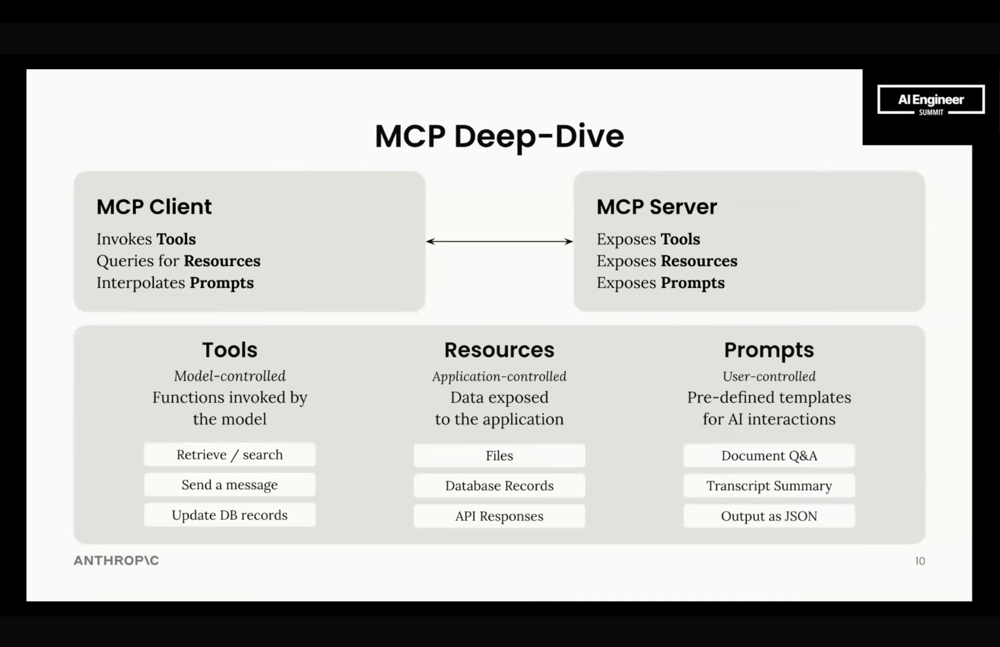
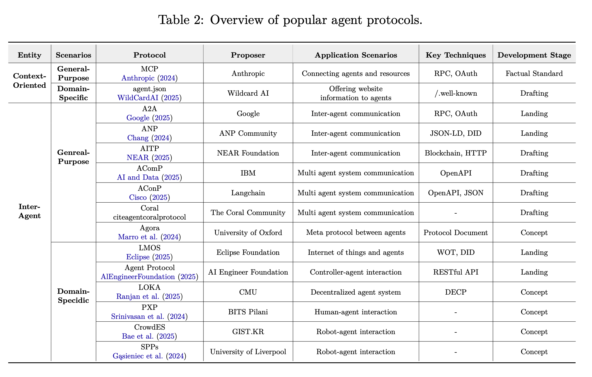
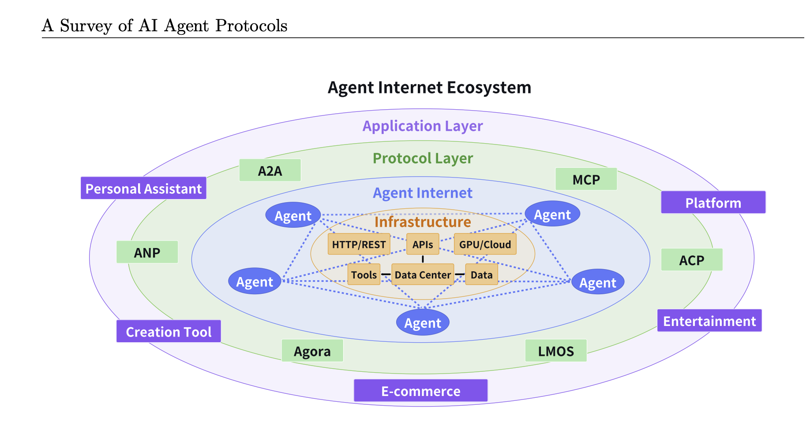
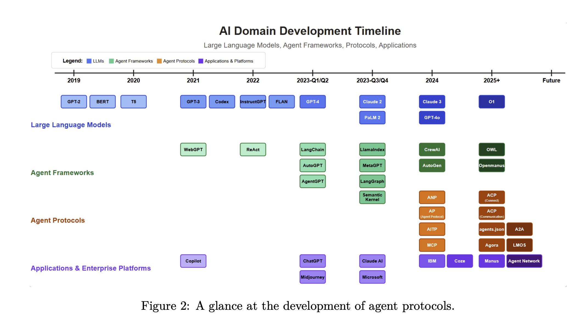
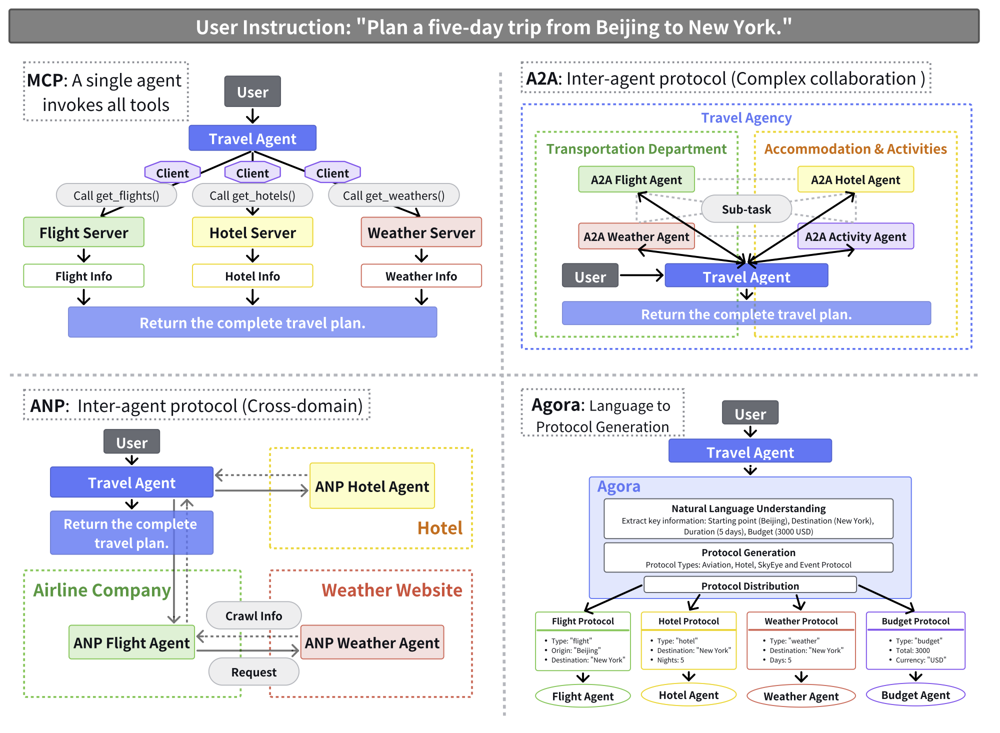

[](https://xtechnology.dev/)

<style type="text/css">
  h1:first-child {
    display: none;
  }

  img[alt="autonomous agent 2023"],img[alt="alt text"],img[alt="function call flow"],img[alt="inspector"], img[alt="text splitter example"], img[alt="embeddings vs indexing"], img[alt="embedding space"], img[alt="what are embedding models"], img[alt="RAG Triad"], img[alt="reranking process"],
  img[alt="code agent work diagram"], img[alt="Planning"], img[alt="ANP"], img[alt="ANP Protocol Architecture"],
  img[alt="agent protocols overview table"], img[alt="agent protocol use cases"] {
    width: 500px;
    max-height: 600px;
  }

  img:not([alt]), img[alt=""] {
    width: 500px;
    max-height: 600px;
  }
  /* twitter button */
  .twitter-btn {
    width: 200px;
    display: inline-block;
    overflow: hidden;
    text-align: left;
    white-space: nowrap;
    vertical-align: top:
    zoom: 1;
    font-size: 13px;
    line-height: 26px;
    font-family: "Helvetica Neue",Arial,sans-serif;
  }
  .twitter-btn a {
    height: 28px;
    padding: 1px 10px 1px 9px;
    border-radius: 4px;
    position: relative;
    font-weight: 500;
    color: #fff;
    cursor: pointer;
    background-color: #1b95e0;
    border-radius: 3px;
    box-sizing: border-box;
    display: inline-block;
    text-decoration: none;
  }
  .twitter-btn a:hover {
    background-color: #0c7abf;
  }
  .twitter-btn a i {
    width: 18px;
    height: 18px;
    top: 4px;
    position: relative;
    display: inline-block;
    background: transparent 0 0 no-repeat;
    background-image: url(data:image/svg+xml,%3Csvg%20xmlns%3D%22http%3A%2F%2Fwww.w3.org%2F2000%2Fsvg%22%20viewBox%3D%220%200%2072%2072%22%3E%3Cpath%20fill%3D%22none%22%20d%3D%22M0%200h72v72H0z%22%2F%3E%3Cpath%20class%3D%22icon%22%20fill%3D%22%23fff%22%20d%3D%22M68.812%2015.14c-2.348%201.04-4.87%201.744-7.52%202.06%202.704-1.62%204.78-4.186%205.757-7.243-2.53%201.5-5.33%202.592-8.314%203.176C56.35%2010.59%2052.948%209%2049.182%209c-7.23%200-13.092%205.86-13.092%2013.093%200%201.026.118%202.02.338%202.98C25.543%2024.527%2015.9%2019.318%209.44%2011.396c-1.125%201.936-1.77%204.184-1.77%206.58%200%204.543%202.312%208.552%205.824%2010.9-2.146-.07-4.165-.658-5.93-1.64-.002.056-.002.11-.002.163%200%206.345%204.513%2011.638%2010.504%2012.84-1.1.298-2.256.457-3.45.457-.845%200-1.666-.078-2.464-.23%201.667%205.2%206.5%208.985%2012.23%209.09-4.482%203.51-10.13%205.605-16.26%205.605-1.055%200-2.096-.06-3.122-.184%205.794%203.717%2012.676%205.882%2020.067%205.882%2024.083%200%2037.25-19.95%2037.25-37.25%200-.565-.013-1.133-.038-1.693%202.558-1.847%204.778-4.15%206.532-6.774z%22%2F%3E%3C%2Fsvg%3E);
  }
  .twitter-btn a span {
    margin-left: 4px;
    white-space: nowrap;
    display: inline-block;
    vertical-align: top;
    zoom: 1;
  }

</style>

<div class="twitter-btn">
  <a href="https://twitter.com/XTechnology5/status/1662440871936114688"><i></i></a>
</div>

# Operating Agent-Based Systems - Overview, Configure, Run, Orchestrate, Monitor

This workshop explores how standalone agents operate at the runtime level and how they differ from traditional AI pipelines. We’ll examine agent architecture, planning loops, memory models, and tool execution. We’ll also cover multi-agent coordination, including state isolation and resource control. A key focus is security and governance — capability-based access, sandboxing, and injection risks. Finally, we’ll address observability and supervision: tracing reasoning, auditing tool usage, and implementing control mechanisms for production systems.

All examples and concepts will be grounded in the Node.js stack and we will explore why Node.js is particularly well-suited for building production-ready agent runtimes — serving as the control plane for supervision, integration, streaming execution, and distributed coordination.

## Prerequisites

- Good understanding of JavaScript or TypeScript
- Experience with Node.js and API development
- Basic knowledge of databases and LLMs is helpful but not required

## Code

- [RAG Workshop](https://github.com/x-technology/rag-workshop)

## Agenda

- [Introduction 📢](#introduction)
- [Setup 🛠️](#setup)
- [AI Agents World 🌎](#ai-agents-world)
- [Demo #1 - Standalone Baseline 👋](#demo-1---standalone-baseline)
- [Agents SDK 🧰](#agents-sdk)
- [Demo #2 - SDK-Based Agent 🤖](#demo-2---sdk-based-agent)
- [Agent Protocols 🔗](#agent-protocols)
- [Demo #3 - Orchestration 🎻](#demo-3---orchestration)
- [Runtime 🔒](#runtime)
- [Demo #4 - n8n Integration 🔄](#demo-4---n8n-integration)
- [Demo #5 - Security & Observability 🔍](#demo-5---security--observability)
- [Summary 📚](#summary)
- [Feedback 💬](#feedback)
- [References 🔗](#references)

## Introduction

<!-- disclaimers: we are not DS, focus on usage, introduce high level and black box context -->

- Explore RAG's scope, architecture and components
- Demo various RAG aspects with chosen technologies
- Feedback & evaluate

### Alex Korzhikov


Software Engineer, Netherlands

My primary interest is self development and craftsmanship. I enjoy exploring technologies, coding open source and enterprise projects, teaching, speaking and writing about programming - JavaScript, Node.js, TypeScript, Go, Java, Docker, Kubernetes, JSON Schema, DevOps, Web Components, Algorithms 🎧 ⚽️ 💻 👋 ☕️ 🌊 🎾

- [AlexKorzhikov](https://www.linkedin.com/in/alex-korzhikov/)
- [korzio](https://github.com/korzio)

### Pavlik Kiselev


Software Engineer, Netherlands

JavaScript developer with full-stack experience and frontend passion. He happily works at ING in a Fraud Prevention department, where helps to protect the finances of the ING customers.

- [Pavlik Kiselev](https://www.linkedin.com/in/pavlik-kiselev-06993347/)
- [paulcodiny](https://github.com/paulcodiny)

## Setup

- Node.js
- Ollama / OpenAI
- `npm i langchain`

## AI Agents World

- [Agents vs Workflows](https://www.anthropic.com/engineering/building-effective-agents)

> - Workflows are systems where LLMs and tools are orchestrated through predefined code paths.
> - Agents, on the other hand, are systems where LLMs dynamically direct their own processes and tool usage, maintaining control over how they accomplish tasks.

  - RAG Example

- AI agents

[](https://lilianweng.github.io/posts/2023-06-23-agent/)

> AI agents are AI programs built on top of LLMs. They use LLM information-processing capabilities to obtain data, make decisions, and take actions on behalf of human users.

> The concept of an AI agent refers to a system or program that is capable of autonomously performing tasks on behalf of a user or another system by designing its workflow and utilizing available tools.

> Agents can be used for open-ended problems where it’s difficult or impossible to predict the required number of steps, and where you can’t hardcode a fixed path.


  - LLM
  - Loop
  - [Planning](https://arxiv.org/pdf/2402.02716)
    
      - task decomposition, multi-plan selection, external module-aided planning, reflection and refinement and memory-augmented planning
      p = (a0, a1, · · · , at) = plan(E, g; Θ, P).
      g0, g1, · · · , gn = decompose(E, g; Θ, P);
      pi = (ai0, ai1, · · · aim) = sub-plan(E, gi; Θ, P).
      - Agent architectures: ReAct, PRACT, RAISE, Reflexion

```ts
// ReAct
while (true) {
  const response = await llm(messages, tools);

  if (response.tool_call) {
    const result = await runTool(response.tool_call);
    messages.push(result);
  } else {
    return response.output;
  }
}
```

```ts
// Reflector
export async function reflexionLoop(task: string) {
  let bestAnswer = null;
  let bestScore = -Infinity;

  for (let i = 0; i < 3; i++) {
    console.log(`Attempt ${i + 1}`);

    const trajectory = await runAgent(task);
    const evaluation = await evaluateTrajectory(task, trajectory);
    const reflection = await reflect(task, trajectory, evaluation);

    storeReflection(reflection);

    console.log("Score:", evaluation.score);
    console.log("Lessons:", reflection.lessons);

    if (evaluation.score > bestScore) {
      bestScore = evaluation.score;
      bestAnswer = trajectory.finalAnswer;
    }
  }

  return bestAnswer;
}
```

    - Evaluation
  - Memory
  - Tools
    > ways for an LLM to act outside its context - read data (files, APIs, web), compute (code execution), act (send email, write DB, click UI)
    - MCP
  - Guardrails
  - components - memory, llm, reasoning, research models, guardrails


<!-- > Agents are AI systems that can:
>
> Make decisions about what actions to take
> Use tools to accomplish tasks
> Maintain state and context
> Learn from previous interactions
> Work towards specific goals
> Agentic flow is not necessarily a completely independent agent, but it can still make some decisions during the flow execution
>
> A typical agentic flow consists of:
>
> Receiving a user request
> Analyzing the request and available tools
> Deciding on the next action
> Executing the action using appropriate tools
> Evaluating the results
> Either completing the task or continuing with more actions
> The key difference from basic RAG is that agents can:
>
> Make multiple search queries
> Combine information from different sources
> Decide when to stop searching
> Use their own knowledge when appropriate
> Chain multiple actions together
>
> So in agentic RAG, the system
> has access to the history of previous actions
> makes decisions independently based on the current information and the previous actions


https://www.anthropic.com/engineering/building-effective-agents

> "Agent" can be defined in several ways. Some customers define agents as fully autonomous systems that operate independently over extended periods, using various tools to accomplish complex tasks. Others use the term to describe more prescriptive implementations that follow predefined workflows. At Anthropic, we categorize all these variations as agentic systems, but draw an important architectural distinction between workflows and agents:

Workflows are systems where LLMs and tools are orchestrated through predefined code paths.
Agents, on the other hand, are systems where LLMs dynamically direct their own processes and tool usage, maintaining control over how they accomplish tasks.

> MCP is one way for AI agents to find the information they need and to take actions. It helps connect AI agents to the "outside world," so to speak — the world beyond the LLM's training data. (Other methods include API integrations and headless browsing.)

> an LLM agent typically consists of:
> - Foundation Model,  typically a large language model or a multimodal large model,
which provides essential capabilities for reasoning, understanding language, and interpreting multimodal information
> - Memory Systems: LLM agents implement both short-term and long-term memory components to maintain context across interactions and store relevant information for future use
> - Planning: Planning is a fundamental aspect of agent research (), enabling agents to break down complex tasks into smaller, manageable subtasks
> - Tool-Using: Although LLMs inherently face limitations in mathematical reasoning, logical operations, and knowledge beyond their trained corpus, agents overcome these constraints by integrating external tools and APIs
> - Action Execution: The ability to interact with their environment by executing actions, whether through API calls, database queries, or interaction
with external systems.

https://arxiv.org/abs/2504.16736

-->

## Demo #1 - Standalone Baseline

## Agents SDK

|                                | **Claude Agent SDK**                                         | **OpenAI Agents SDK**                  | **Google ADK**                                           | **Vercel AI SDK**                      | **LangChain / LangGraph**                        | **CrewAI**                           | **OpenClaw**                                             |
| ------------------------------ | ------------------------------------------------------------ | -------------------------------------- | -------------------------------------------------------- | -------------------------------------- | ------------------------------------------------ | ------------------------------------ | -------------------------------------------------------- |
| **Primary purpose**            | Runtime for Claude-based agents with tool use + MCP          | Build multi-step agents on OpenAI APIs | Build agents on Gemini / Vertex AI                       | Fullstack AI toolkit (not agent-first) | Composable chains + stateful agent graphs        | Role-based multi-agent orchestration | Local-first autonomous assistant                         |
| **Languages**                  | TypeScript, Python ⚠️ *(Python partial)*                     | TypeScript, Python                     | Python, TypeScript, Go, and Java                           | TypeScript / JavaScript                | Python, TypeScript                               | Python                               | TypeScript / Node.js                                     |
| **Model support**              | Claude only                                                  | OpenAI (⚠️ LiteLLM workaround)         | Gemini / Vertex                                          | Model-agnostic                         | Model-agnostic                                   | Model-agnostic                       | Model-agnostic                                           |
| **Agent loop / orchestration** | Subagents, tool loops, hooks                                 | Agents + handoffs                      | Pipelines (seq/parallel) ⚠️ *(loop flexibility unclear)* | Tool-based loops (lightweight)         | **LangGraph DAG + cycles (full state machines)** | Sequential + hierarchical crews      | Autonomous loop (AutoGPT-style) ⚠️ *(behavior unstable)* |
| **Tools**                      | MCP, bash, browser, file system                              | Function calling, tools, MCP           | Google tools + functions ⚠️ *(MCP maturity?)*            | Tool calling, MCP                      | 500+ integrations                                | Custom tools                         | Plugins, browser, apps                                   |
| **Memory**                     | CLAUDE.md + runtime context ⚠️ *(not true long-term memory)* | Threads + state                        | Vertex memory ⚠️ *(needs validation depth)*              | Per-request (stateless by default)     | Buffers + vector DB                              | Built-in memory abstractions         | Persistent local memory                                  |
| **Multi-agent**                | Subagents ⚠️ *(basic vs true orchestration)*                 | Native handoffs                        | A2A protocol ⚠️ *(early stage)*                          | ❌ Limited                              | ✅ Advanced (LangGraph multi-node)                | ✅ Core concept                       | ❌                                                        |
| **Structured output**          | JSON / tool schemas                                          | Strong schema enforcement              | Pydantic-style outputs                                   | `generateObject`                       | Output parsers                                   | Typed tasks                          | ⚠️ CHECK                                                 |
| **Streaming**                  | Yes                                                          | Yes                                    | Yes                                                      | ✅ First-class                          | Yes                                              | Partial ⚠️                           | ⚠️ CHECK                                                 |
| **MCP support**                | ✅ First-class                                                | ✅                                      | ⚠️ Emerging                                              | ✅                                      | ⚠️ Via adapters                                  | ❌                                    | ⚠️ CHECK                                                 |
| **Tracing / observability**    | Hooks                                                        | Built-in tracing                       | Vertex observability                                     | Built-in telemetry                     | LangSmith                                        | Logging                              | ⚠️ CHECK                                                 |
| **Guardrails**                 | Permissions + tool control                                   | Built-in guardrails                    | Vertex policies                                          | Middleware                             | Custom callbacks                                 | Role constraints                     | ⚠️ CHECK                                                 |
| **UI / frontend**              | ❌                                                            | ❌                                      | ❌                                                        | ✅ **Best-in-class (React, Next.js)**   | ❌                                                | ❌                                    | Messaging apps                                           |
| **Visual / no-code**           | ❌                                                            | ⚠️ Agent Builder (limited)             | ✅ Vertex Studio                                          | ❌                                      | ⚠️ LangSmith UI                                  | ❌                                    | ❌                                                        |
| **Privacy / hosting**          | Cloud (Anthropic)                                            | Cloud (OpenAI)                         | Cloud (Google)                                           | Depends on provider                    | Self-host possible                               | Self-host possible                   | ✅ Local-first                                            |
| **Best fit**                   | Tool-heavy automation agents                                 | Fast production agents                 | Google ecosystem                                         | AI web apps                            | Complex agent systems                            | Multi-agent simulations              | Personal assistants                                      |
| **Maturity**                   | New (2025)                                                   | New (2025)                             | New (2025)                                               | Mature                                 | Most mature                                      | Mature                               | ⚠️ Varies                                                |

Frameworks: CrewAI, LangGraph, MetaGPT
- The [Claude Agent SDK](https://code.claude.com/docs/en/agent-sdk/typescript#query);
- Strands Agents SDK by AWS;
- Rivet, a drag and drop GUI LLM workflow builder; and
- Vellum, another GUI tool for building and testing complex workflows.
- [AI SDK Vercel](https://ai-sdk.dev/docs/introduction)

**claude**

https://code.claude.com/docs/en/agent-sdk/agent-loop

### [Example in docker](https://code.claude.com/docs/en/agent-sdk/secure-deployment#containers)

[built-in tools](https://code.claude.com/docs/en/agent-sdk/agent-loop#built-in-tools)

**openai**

https://developers.openai.com/api/docs/guides/agents/define-agents#when-to-split-one-agent-into-several

[built-in tools](https://openai.github.io/openai-agents-js/guides/tools/?utm_source=chatgpt.com#1-hosted-tools-openai-responses-api)

**[adk](https://adk.dev/get-started/typescript/)**

```ts
import {FunctionTool, LlmAgent} from '@google/adk';
import {z} from 'zod';

/* Mock tool implementation */
const getCurrentTime = new FunctionTool({
  name: 'get_current_time',
  description: 'Returns the current time in a specified city.',
  parameters: z.object({
    city: z.string().describe("The name of the city for which to retrieve the current time."),
  }),
  execute: ({city}) => {
    return {status: 'success', report: `The current time in ${city} is 10:30 AM`};
  },
});

export const rootAgent = new LlmAgent({
  name: 'hello_time_agent',
  model: 'gemini-flash-latest',
  description: 'Tells the current time in a specified city.',
  instruction: `You are a helpful assistant that tells the current time in a city.
                Use the 'getCurrentTime' tool for this purpose.`,
  tools: [getCurrentTime],
});
```

crewai

key features:
- model-agnostic
- deployment-agnostic

### [Langchain](https://js.langchain.com/docs/introduction/) 🦜️🔗

LangGraph

> LangChain is a Python and JavaScript framework that brings flexible abstractions and AI-first toolkit for developers to build with GenAI and integrate your applications with LLMs. It includes components for abstracting and chaining LLM prompts, configure and use vector databases (for semantic search), document loaders and splitters (to analyze documents and learn from them), output parsers, and more.

**OpenClaw**

## Demo #2 - SDK-Based Agent

## [Agent Protocols](https://github.com/zoe-yyx/Awesome-AIAgent-Protocol)

- Agentic AI systems

[](https://arxiv.org/abs/2504.16736)

](https://a2a-protocol.org/latest/assets/agentic-stack.png)

> Agent protocols are standardized frameworks that define the rules, formats, and procedures for structured communication among agents and between agents and external systems

- MCP

Inter-Agent Protocols

- [Agent-to-Agent (A2A)](https://github.com/a2aproject/A2A)

released in 04.2025

Key Concepts:
- Agent Card	A JSON metadata document describing an agent's identity, capabilities, endpoint, skills, and authentication requirements.	Enables clients to discover agents and understand how to interact with them securely and effectively.
- Task	A stateful unit of work initiated by an agent, with a unique ID and defined lifecycle.	Facilitates tracking of long-running operations and enables multi-turn interactions and collaboration.
- Message	A single turn of communication between a client and an agent, containing content and a role ("user" or "agent").	Conveys instructions, context, questions, answers, or status updates that are not necessarily formal artifacts.
- Part	The fundamental content container used within Messages and Artifacts. A Part holds one of: text content, a file reference (URL or inline bytes), or structured data.	Provides flexibility for agents to exchange various content types within messages and artifacts.
- Artifact	A tangible output generated by an agent during a task (for example, a document, image, or structured data).	Delivers the concrete results of an agent's work, ensuring structured and retrievable outputs.

- Service Discovery
  - Registry
  - Semantic Router


[A2A and MCP: Detailed Comparison](https://a2a-protocol.org/latest/topics/a2a-and-mcp/)

- [ANP - Agent Network Protocol](https://www.agent-network-protocol.com/)

> to define how agents connect with each other, building an open, secure, and efficient collaboration network for billions of intelligent agents


- MCP (Model Context Protocol): A bridge connecting AI models with tools/resources, using a client-server architecture, suitable for a single model accessing multiple tools and resources, such as accessing search engines, calling calculators, etc.
- A2A (Agent2Agent): Designed for complex agent collaboration within enterprises, focusing on task-driven collaborative processes, suitable for completing complex task chains in trusted environments, such as workflow automation within enterprises.
- ANP (Agent Network Protocol): Created for agent interconnection on the open internet, using a peer-to-peer architecture, enabling cross-platform and cross-organization agent discovery and interaction, such as communication between agents from different companies.

In short: Use MCP to connect tools or resources, A2A for agent collaboration within enterprises, and ANP for agent connections on the open internet.

OR

- MCP: Focused on providing structured context and tool integration for LLMs, emphasizing
the connection between models and external resources.
- ANP: Introduced decentralized identity mechanisms (e.g., W3C DID), enabling peer-to-peer
communication between agents, enhancing system autonomy and flexibility.
- A2A: Provided a standardized framework for collaboration between enterprise-level agents,
supporting task management, message exchange, and multimodal outputs, thus facilitating
cross-platform and multi-vendor agent collaboration.

[](https://arxiv.org/abs/2504.16736)

[](https://arxiv.org/abs/2504.16736)

[](https://arxiv.org/abs/2504.16736)

## Demo #3 - Orchestration

## Runtime

- Security

https://code.claude.com/docs/en/agent-sdk/secure-deployment

- Infrastruscture
n8n
agent stack

- Observability

## Demo #4 - n8n Integration

## Demo #5 - Security & Observability

## Summary

The workshop overviews and ...

## Feedback

Please [share your feedback](https://app.sli.do/event/wV641HGAr8jeVnULeLAAg2) on the workshop. Thank you and have a great coding!

<iframe src="https://wall.sli.do/event/wV641HGAr8jeVnULeLAAg2/?section=fdc6bb93-244d-4320-ac2d-cd6a3ffd6a38" width="50%" height="500px"></iframe>

If you like the workshop, you can become our [patron](https://www.patreon.com/xtechnology), yay! 🙏

## References

- [Building effective agents - Engineering at Anthropic Dec 19, 2024](https://www.anthropic.com/engineering/building-effective-agents)
- [LLM Zoomcamp - A Free Course on Real-Life Applications of LLMs](https://github.com/DataTalksClub/llm-zoomcamp)
- [A Survey of AI Agent Protocols](https://arxiv.org/abs/2504.16736)
- [Lilian Weng - LLM Powered Autonomous Agents](https://lilianweng.github.io/posts/2023-06-23-agent/)
- [Awesome AI Agent Protocols](https://github.com/zoe-yyx/Awesome-AIAgent-Protocol)
- [Understanding the planning of LLM agents: A survey, 5 Feb 2024](https://arxiv.org/pdf/2402.02716)
- [A2A: The Agent2Agent Protocol - DeepLearning.ai](https://learn.deeplearning.ai/courses/a2a-the-agent2agent-protocol)


### Technologies

- LLM
- Langchain
- RAG
- AI Agents
- MCP
- OpenClaw
- n8n

<!--

# Drafts

Пока что такой план обсудили на воркшоп
1. Теория про агентов. Что такое вообще
2. Разработка агента "на коленке"
3. Теория про SDK для агентов (посмотрю варианты)
4. Разработка агента на SDK.
5. Теория про оркестрацию. Что делать, когда агентов несколько
6. Разработка ещё одного-двух агентов и встраивание его в n8n
7. Теория общих правил оркестрации. Безопасность, мониторинг и т.д.
8. Практика
9. Конец

## 2026-04-29

- [ ] @pavlik to make use case diagram
- [ ] @pavlik @alex session inMemoryRunner alternatives
  await runner.sessionService.createSession({ appName: APP_NAME, userId: USER_ID, sessionId: SESSION_ID });
- [ ] @pavlik from 03 example remove llm from agents

## 2026-04-28

- [ ] what are stop execute evaluation practices?
- [x] does n8n use a2a?
- [x] Why Node.js for agent runtimes?

## 2026-04-22

- [ ] need to try play with skills in artificial project

## 2026-04-21

- [x] need to try out next time with docker image

## 2026-04-20

- [x] read about [claude sdk](https://code.claude.com/docs/en/agent-sdk/claude-code-features)

-->