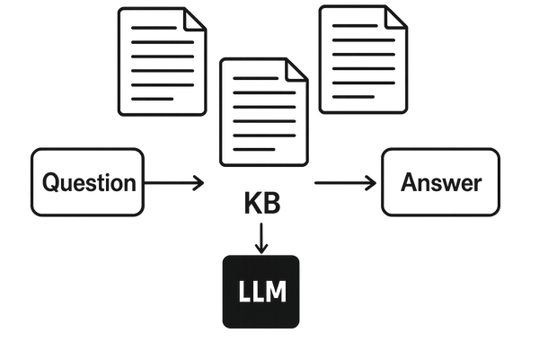
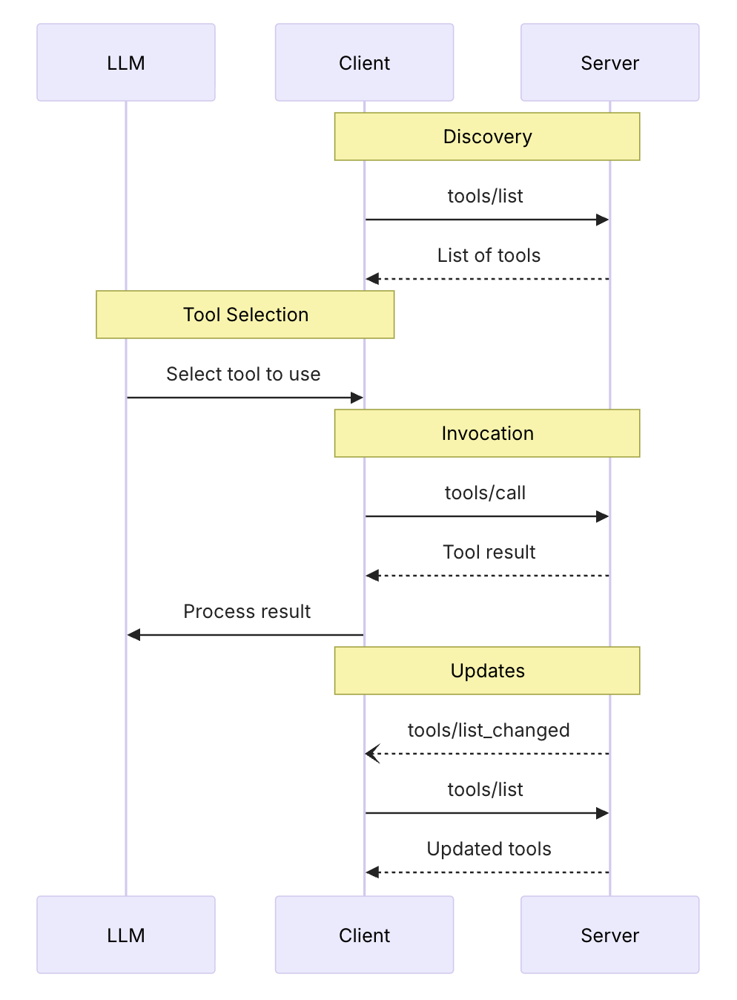
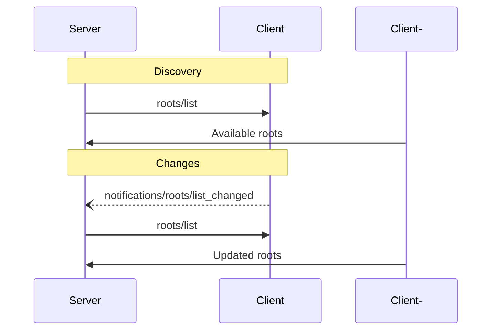

[](https://xtechnology.dev/)

<style type="text/css">
  h1:first-child {
    display: none;
  }

  img[alt="autonomous agent 2023"],img[alt="alt text"],img[alt="function call flow"],img[alt="inspector"], img[alt="text splitter example"], img[alt="embeddings vs indexing"], img[alt="embedding space"], img[alt="what are embedding models"], img[alt="RAG Triad"], img[alt="reranking process"],
  img[alt="code agent work diagram"], img[alt="Planning"], img[alt="ANP"], img[alt="ANP Protocol Architecture"],
  img[alt="agent protocol use cases"], img:not([alt]), img[alt=""], img[alt*="normal size"] {
    width: 500px;
    max-height: 600px;
  }

  img[alt*="photo"], img[alt*="smaller"] {
    max-width: 300px !important;
    max-height: 300px;
  }
  /* twitter button */
  .twitter-btn {
    width: 200px;
    display: inline-block;
    overflow: hidden;
    text-align: left;
    white-space: nowrap;
    vertical-align: top:
    zoom: 1;
    font-size: 13px;
    line-height: 26px;
    font-family: "Helvetica Neue",Arial,sans-serif;
  }
  .twitter-btn a {
    height: 28px;
    padding: 1px 10px 1px 9px;
    border-radius: 4px;
    position: relative;
    font-weight: 500;
    color: #fff;
    cursor: pointer;
    background-color: #1b95e0;
    border-radius: 3px;
    box-sizing: border-box;
    display: inline-block;
    text-decoration: none;
  }
  .twitter-btn a:hover {
    background-color: #0c7abf;
  }
  .twitter-btn a i {
    width: 18px;
    height: 18px;
    top: 4px;
    position: relative;
    display: inline-block;
    background: transparent 0 0 no-repeat;
    background-image: url(data:image/svg+xml,%3Csvg%20xmlns%3D%22http%3A%2F%2Fwww.w3.org%2F2000%2Fsvg%22%20viewBox%3D%220%200%2072%2072%22%3E%3Cpath%20fill%3D%22none%22%20d%3D%22M0%200h72v72H0z%22%2F%3E%3Cpath%20class%3D%22icon%22%20fill%3D%22%23fff%22%20d%3D%22M68.812%2015.14c-2.348%201.04-4.87%201.744-7.52%202.06%202.704-1.62%204.78-4.186%205.757-7.243-2.53%201.5-5.33%202.592-8.314%203.176C56.35%2010.59%2052.948%209%2049.182%209c-7.23%200-13.092%205.86-13.092%2013.093%200%201.026.118%202.02.338%202.98C25.543%2024.527%2015.9%2019.318%209.44%2011.396c-1.125%201.936-1.77%204.184-1.77%206.58%200%204.543%202.312%208.552%205.824%2010.9-2.146-.07-4.165-.658-5.93-1.64-.002.056-.002.11-.002.163%200%206.345%204.513%2011.638%2010.504%2012.84-1.1.298-2.256.457-3.45.457-.845%200-1.666-.078-2.464-.23%201.667%205.2%206.5%208.985%2012.23%209.09-4.482%203.51-10.13%205.605-16.26%205.605-1.055%200-2.096-.06-3.122-.184%205.794%203.717%2012.676%205.882%2020.067%205.882%2024.083%200%2037.25-19.95%2037.25-37.25%200-.565-.013-1.133-.038-1.693%202.558-1.847%204.778-4.15%206.532-6.774z%22%2F%3E%3C%2Fsvg%3E);
  }
  .twitter-btn a span {
    margin-left: 4px;
    white-space: nowrap;
    display: inline-block;
    vertical-align: top;
    zoom: 1;
  }

</style>

<div class="twitter-btn">
  <a href="https://twitter.com/XTechnology5/status/1662440871936114688"><i></i></a>
</div>

# Operating Agent-Based Systems - Overview, Configure, Run, Orchestrate, Monitor

This workshop explores how standalone agents operate at the runtime level and how they differ from traditional AI pipelines. We examine agent architecture, planning loops, memory models, and tool execution. We also cover multi-agent coordination, including state isolation and resource control. A key focus is security and governance — capability-based access, sandboxing, and injection risks. Finally, we address observability and supervision: tracing reasoning, auditing tool usage, and implementing control mechanisms for production systems. All examples and concepts are grounded in the Node.js stack and we explore why Node.js is particularly well-suited for building production-ready agent runtimes — serving as the control plane for supervision, integration, streaming execution, and distributed coordination.

## Prerequisites

- Good understanding of JavaScript or TypeScript
- Experience with Node.js and API development
- Basic knowledge of databases and LLMs is helpful but not required

## Goals

- Understand AI agent architecture: loop, planning, memory, tools, guardrails
- Compare agent SDKs and protocols (MCP, A2A, ANP)
- Build and orchestrate agents with Node.js as the control plane
- Add security, observability, and n8n integration to production systems

## Code

- [Agents Workshop](https://github.com/x-technology/workshop-agents)

## Agenda

- [Introduction 📢](#introduction)
- [Setup 🛠️](#setup)
- [AI Agents World 🌎](#ai-agents-world)
- [Demo #1 - Standalone Baseline 👋](#demo-1---standalone-baseline)
- [Agents SDK 🧰](#agents-sdk)
- [Demo #2 - SDK-Based Agent 🤖](#demo-2---sdk-based-agent)
- [Agent Protocols 🔗](#agent-protocols)
- [Demo #3 - Orchestration 🎻](#demo-3---orchestration)
- [Runtime 🔒](#runtime)
- [Demo #4 - n8n Integration 🔄](#demo-4---n8n-integration)
- [Demo #5 - Security & Observability 🔍](#demo-5---security--observability)
- [Summary 📚](#summary)
- [Feedback 💬](#feedback)
- [References 🔗](#references)

## Introduction

<!-- disclaimers: we are not DS, focus on usage, introduce high level and black box context -->

### Alex Korzhikov


Software Engineer, Netherlands

My primary interest is self development and craftsmanship. I enjoy exploring technologies, coding open source and enterprise projects, teaching, speaking and writing about programming - JavaScript, Node.js, TypeScript, Go, Java, Docker, Kubernetes, JSON Schema, DevOps, Web Components, Algorithms 🎧 ⚽️ 💻 👋 ☕️ 🌊 🎾

- [AlexKorzhikov](https://www.linkedin.com/in/alex-korzhikov/)
- [korzio](https://github.com/korzio)

### Pavlik Kiselev


Software Engineer, Netherlands

JavaScript developer with full-stack experience and frontend passion. He happily works at ING in a Fraud Prevention department, where helps to protect the finances of the ING customers.

- [Pavlik Kiselev](https://www.linkedin.com/in/pavlik-kiselev-06993347/)
- [paulcodiny](https://github.com/paulcodiny)

## Setup

- Node.js
- Ollama / OpenAI
- `npm i langchain`

## AI Agents World

### [RAG Recap](/rag#about-everything)



### [LLM Agents vs Workflows](https://www.anthropic.com/engineering/building-effective-agents)

> - Workflows are systems where LLMs and tools are orchestrated through predefined code paths

### AI agents

> Systems where LLMs dynamically direct their own processes and tool usage, maintaining control over how they accomplish tasks

[](https://lilianweng.github.io/posts/2023-06-23-agent/)

A system that autonomously performing tasks on behalf of a user or another system by designing its workflow and utilizing available tools

**LLM** - Large Language Models trained on tons of sources and materials, having billions of parameters

**Loop**

[](https://code.claude.com/docs/en/agent-sdk/agent-loop)

**[Planning](https://arxiv.org/pdf/2402.02716)** - task decomposition, multi-plan selection, external module-aided planning, reflection and refinement, memory-augmented planning, evaluation


```math
p = (a0, a1, · · · , at) = plan(E, g; Θ, P).
g0, g1, · · · , gn = decompose(E, g; Θ, P);
pi = (ai0, ai1, · · · aim) = sub-plan(E, gi; Θ, P).
```

Prompt Architectures - ReAct, PRACT, RAISE, Reflexion, ...

```ts
// ReAct
while (true) {
  const response = await llm(messages, tools);

  if (response.tool_call) {
    const result = await runTool(response.tool_call);
    messages.push(result);
  } else {
    return response.output;
  }
}
```

```ts
// Reflexion
export async function reflexionLoop(task: string) {
  let bestAnswer = null;
  let bestScore = -Infinity;

  for (let i = 0; i < 3; i++) {
    console.log(`Attempt ${i + 1}`);

    const trajectory = await runAgent(task);
    const evaluation = await evaluateTrajectory(task, trajectory);
    const reflection = await reflect(task, trajectory, evaluation);

    storeReflection(reflection);

    console.log("Score:", evaluation.score);
    console.log("Lessons:", reflection.lessons);

    if (evaluation.score > bestScore) {
      bestScore = evaluation.score;
      bestAnswer = trajectory.finalAnswer;
    }
  }

  return bestAnswer;
}
```


**Memory** - the processes used to gain, store, retain, and later retrieve information. Short-term vs long-term memory.

**Tools** - extend LLM with ability to act outside its context - read data (files, APIs, web), compute (code execution), act (send email, write DB, click UI)

<!-- > Agents are AI systems that can:
>
> Make decisions about what actions to take
> Use tools to accomplish tasks
> Maintain state and context
> Learn from previous interactions
> Work towards specific goals
> Agentic flow is not necessarily a completely independent agent, but it can still make some decisions during the flow execution
>
> A typical agentic flow consists of:
>
> Receiving a user request
> Analyzing the request and available tools
> Deciding on the next action
> Executing the action using appropriate tools
> Evaluating the results
> Either completing the task or continuing with more actions
> The key difference from basic RAG is that agents can:
>
> Make multiple search queries
> Combine information from different sources
> Decide when to stop searching
> Use their own knowledge when appropriate
> Chain multiple actions together
>
> So in agentic RAG, the system
> has access to the history of previous actions
> makes decisions independently based on the current information and the previous actions


https://www.anthropic.com/engineering/building-effective-agents

> "Agent" can be defined in several ways. Some customers define agents as fully autonomous systems that operate independently over extended periods, using various tools to accomplish complex tasks. Others use the term to describe more prescriptive implementations that follow predefined workflows. At Anthropic, we categorize all these variations as agentic systems, but draw an important architectural distinction between workflows and agents:

Workflows are systems where LLMs and tools are orchestrated through predefined code paths.
Agents, on the other hand, are systems where LLMs dynamically direct their own processes and tool usage, maintaining control over how they accomplish tasks.

> MCP is one way for AI agents to find the information they need and to take actions. It helps connect AI agents to the "outside world," so to speak — the world beyond the LLM's training data. (Other methods include API integrations and headless browsing.)

> an LLM agent typically consists of:
> - Foundation Model,  typically a large language model or a multimodal large model,
which provides essential capabilities for reasoning, understanding language, and interpreting multimodal information
> - Memory Systems: LLM agents implement both short-term and long-term memory components to maintain context across interactions and store relevant information for future use
> - Planning: Planning is a fundamental aspect of agent research (), enabling agents to break down complex tasks into smaller, manageable subtasks
> - Tool-Using: Although LLMs inherently face limitations in mathematical reasoning, logical operations, and knowledge beyond their trained corpus, agents overcome these constraints by integrating external tools and APIs
> - Action Execution: The ability to interact with their environment by executing actions, whether through API calls, database queries, or interaction
with external systems.

https://arxiv.org/abs/2504.16736

-->

## Demo #1 - Standalone Baseline

## Agents SDK

|                                | **[Claude Agent SDK](https://code.claude.com/docs/en/agent-sdk/typescript)**                                         | **[OpenAI Agents SDK](https://developers.openai.com/api/docs/guides/agents/define-agents)**                  | **[Google ADK](https://adk.dev/get-started/typescript/)**                                           | **[AI SDK Vercel](https://ai-sdk.dev/docs/introduction)**                      | **[LangChain](https://docs.langchain.com/oss/javascript/langchain/overview) / [LangGraph](https://docs.langchain.com/oss/javascript/langgraph/overview)**                        |
| ------------------------------ | ------------------------------------------------------------ | -------------------------------------- | -------------------------------------------------------- | -------------------------------------- | ------------------------------------------------ |
| **Primary purpose**            | Runtime for Claude-based agents with tool use + MCP          | Build multi-step agents on OpenAI APIs | Build agents on Gemini / Vertex AI                       | Fullstack AI toolkit (not agent-first) | Composable chains + stateful agent graphs        |
| **Languages**                  | TypeScript, Python ⚠️ *(Python partial)*                     | TypeScript, Python                     | Python, TypeScript, Go, and Java                         | TypeScript / JavaScript                | Python, TypeScript                               |
| **Model support**              | Claude only                                                  | OpenAI (⚠️ LiteLLM workaround)         | Gemini / Vertex                                          | Model-agnostic                         | Model-agnostic                                   |
| **Agent loop / orchestration** | Subagents, tool loops, hooks                                 | Agents + handoffs                      | Pipelines (seq/parallel) ⚠️ *(loop flexibility unclear)* | Tool-based loops (lightweight)         | **LangGraph DAG + cycles (full state machines)** |
| **Loop control**               | ⚠️ Hooks into steps, loop is internal                        | ❌ Hidden — tools + instructions only   | ⚠️ Orchestration-based, not loop-level                   | ❌ Loop is internal                     | ✅ Full — define nodes, edges, stop conditions    |
| **Tools**                      | MCP, bash, browser, file system                              | Function calling, tools, MCP           | Google tools + functions ⚠️ *(MCP maturity?)*            | Tool calling, MCP                      | 500+ integrations                                |
| **Memory**                     | CLAUDE.md + runtime context ⚠️ *(not true long-term memory)* | Threads + state                        | Vertex memory ⚠️ *(needs validation depth)*              | Per-request (stateless by default)     | Buffers + vector DB                              |
| **Multi-agent**                | Subagents ⚠️ *(basic vs true orchestration)*                 | Native handoffs                        | A2A protocol ⚠️ *(early stage)*                          | ❌ Limited                              | ✅ Advanced (LangGraph multi-node)                |
| **MCP support**                | ✅ First-class                                                | ✅                                      | ⚠️ Emerging                                              | ✅                                      | ⚠️ Via adapters                                  |
| **Best fit**                   | Tool-heavy automation agents                                 | Fast production agents                 | Google ecosystem                                         | AI web apps                            | Complex agent systems                            |

```ts
import {FunctionTool, LlmAgent} from '@google/adk';
import {z} from 'zod';

/* Mock tool implementation */
const getCurrentTime = new FunctionTool({
  name: 'get_current_time',
  description: 'Returns the current time in a specified city.',
  parameters: z.object({
    city: z.string().describe("The name of the city for which to retrieve the current time."),
  }),
  execute: ({city}) => {
    return {status: 'success', report: `The current time in ${city} is 10:30 AM`};
  },
});

export const rootAgent = new LlmAgent({
  name: 'hello_time_agent',
  model: 'gemini-flash-latest',
  description: 'Tells the current time in a specified city.',
  instruction: `You are a helpful assistant that tells the current time in a city.
                Use the 'getCurrentTime' tool for this purpose.`,
  tools: [getCurrentTime],
});
```

Key features:
- [Agent loop](https://code.claude.com/docs/en/agent-sdk/agent-loop)
- Model-agnostic
- Deployment-agnostic
- Built-in tools - file operations, web Search, execution. Compare [claude](https://code.claude.com/docs/en/agent-sdk/agent-loop#built-in-tools) VS [openai](https://openai.github.io/openai-agents-js/guides/tools/?utm_source=chatgpt.com#1-hosted-tools-openai-responses-api)

## Demo #2 - SDK-Based Agent

## [Agent Protocols](https://github.com/zoe-yyx/Awesome-AIAgent-Protocol)

**Agentic AI** - systems composed of multiple co-ordinated AI agents that can break
down tasks, collaborate, and pursue complex objectives autonomously over extended periods.

[](https://arxiv.org/abs/2504.16736)

> **Agent protocols** are standardized frameworks that define the rules, formats, and procedures for structured communication among agents and between agents and external systems [(c)](https://arxiv.org/abs/2504.16736)

[](https://arxiv.org/abs/2504.16736)

**MCP** - Model Context Protocol

Anthropic, November 2024, [Specification](https://modelcontextprotocol.io/specification/2025-06-18#overview) based on [the Function calling flow](https://platform.openai.com/docs/guides/function-calling)

```js
for (const toolCall of response.output) {
  if (toolCall.type !== "function_call") {
    continue
  }

  const name = toolCall.name
  const args = JSON.parse(toolCall.arguments)

  const result = callFunction(name, args)
  input.push({
    type: "function_call_output",
    call_id: toolCall.call_id,
    output: result.toString(),
  })
}
```

> MCP provides a standardized way for applications to:
> - Share contextual information with language models
> - Expose tools and capabilities to AI systems
> - Build composable integrations and workflows

<!-- > MCP is a universal and open context-oriented protocol for connecting LLM agents to resources consisting of external data, tools and services in a simpler and more reliable way -->

[Features](https://modelcontextprotocol.io/specification/2025-06-18#features):
- Resources: Context and data, for the user or the AI model to use
- Prompts: Templated messages and workflows for users
- [Tools](https://platform.openai.com/docs/guides/tools): Functions for the AI model to execute
- Communication Layer: Authentication, Notifications, [JSON-RPC](https://www.jsonrpc.org/specification)
- [Servers](https://github.com/modelcontextprotocol/servers)



<!-- 

Clients on AI Agents (host applications) <-> MCP Servers

Clients mainatin connection with servers



> In the initial phase of a complete MCP invocation cycle, when faced with a user query, the host employs the LLMs’ understanding and reasoning capabilities to infer the context necessary to formulate a response to the query. Concurrently, the multiple clients connected to the host provide natural language descriptions of the available resources. Based on the information available, the host determines which resources to request context from and initiating a strategic context request to the corresponding client. In the request phase of the MCP invocation cycle, the client sends an executive context request to the corresponding server, encompassing operations such as data modifications or tool invocations. Upon receiving the client’s request, the server operates on the resources as specified and subsequently transmits the obtained context to the client, which then passes it on to the host. In the response phase of the MCP cycle, the host combines the context obtained to formulate a reply to the user query, thereby completing the cycle.

> [ ] is it right that tool_use is detected by LLM?
https://blog.langchain.com/mcp-fad-or-fixture/

> A function or tool refers in the abstract to a piece of functionality that we tell the model it has access to. As a model generates a response to a prompt, it may decide that it needs data or functionality provided by a tool to follow the prompt's instructions.
> You could give the model access to tools that:
> Get today's weather for a location
> Access account details for a given user ID
> Issue refunds for a lost order
> Or anything else you'd like the model to be able to know or do as it responds to a prompt.
> When we make an API request to the model with a prompt, we can include a list of tools the model could consider using. For example, if we wanted the model to be able to answer questions about the current weather somewhere in the world, we might give it access to a get_weather tool that takes location as an argument.

-->

```json
{
  "name": "get_weather_data",
  "title": "Weather Data Retriever",
  "description": "Get current weather data for a location",
  "inputSchema": {
    "type": "object",
    "properties": {
      "location": {
        "type": "string",
        "description": "City name or zip code"
      }
    },
    "required": ["location"]
  },
  "outputSchema": {
    "type": "object",
    "properties": {
      "temperature": {
        "type": "number",
        "description": "Temperature in celsius"
      },
      "conditions": {
        "type": "string",
        "description": "Weather conditions description"
      },
      "humidity": {
        "type": "number",
        "description": "Humidity percentage"
      }
    },
    "required": ["temperature", "conditions", "humidity"]
  }
}
```

<!-- > Tools let LLMs take actions through your server. Tools can perform computation, fetch data and have side effects. Tools should be designed to be model-controlled - i.e. AI models will decide which tools to call, and the arguments

- [ResourceLink](https://modelcontextprotocol.io/specification/2025-06-18/server/tools#resource-links)

- resources
- prompts
- notifications

```json
{
  jsonrpc: "2.0";
  id: string | number;
  method: string;
  params?: {
    [key: string]: unknown;
  };
}
```

  - Streamable HTTP transport
  - stdio
  - sse
- Lifecycle Management: Connection initialization, capability negotiation, and session control
- Authorization: Authentication and authorization framework for HTTP-based transports
- Attach to agentic product demo?
- Artificial layer, why not to introduce default mcp for any potential API?
https://github.com/alexeygrigorev/rag-agents-workshop
-->

**[Agent-to-Agent (A2A)](https://github.com/a2aproject/A2A)** - Inter-Agent Protocol, April 2025

](https://a2a-protocol.org/latest/assets/agentic-stack.png)

Concepts:
- Agent Card - JSON document describing an agent's abilities & requirements. Enables clients to discover agents and understand how to interact with them effectively.

```ts
const movieAgentCard: AgentCard = {
  name: 'Movie Agent',
  description: 'An agent that can answer questions about movies and actors using TMDB.',
  // Adjust the base URL and port as needed. /a2a is the default base in A2AExpressApp
  url: 'http://localhost:41241/', // Example: if baseUrl in A2AExpressApp
  provider: {
    organization: 'A2A Samples',
    url: 'https://example.com/a2a-samples' // Added provider URL
  },
  version: '0.0.2', // Incremented version
  capabilities: {
    streaming: true, // The new framework supports streaming
    pushNotifications: false, // Assuming not implemented for this agent yet
    stateTransitionHistory: true, // Agent uses history
  },
  securitySchemes: undefined, // Or define actual security schemes if any
  security: undefined,
  defaultInputModes: ['text'],
  defaultOutputModes: ['text', 'task-status'], // task-status is a common output mode
  skills: [
    {
      id: 'general_movie_chat',
      name: 'General Movie Chat',
      description: 'Answer general questions or chat about movies, actors, directors.',
      tags: ['movies', 'actors', 'directors'],
      examples: [
        'Tell me about the plot of Inception.',
        'Recommend a good sci-fi movie.',
        'Who directed The Matrix?',
        'What other movies has Scarlett Johansson been in?',
        'Find action movies starring Keanu Reeves',
        'Which came out first, Jurassic Park or Terminator 2?',
      ],
      inputModes: ['text'], // Explicitly defining for skill
      outputModes: ['text', 'task-status'] // Explicitly defining for skill
    },
  ],
  supportsAuthenticatedExtendedCard: false,
};
```

- Message - Communication between a client and an agent, containing content and a role ("user" or "agent"). Contains instructions, context, questions, answers, or status updates that are not necessarily formal artifacts.

```json
{
  "jsonrpc": "2.0",
  "id": "req-001",
  "method": "SendMessage",
  "params": {
    "message": {
      "role": "user",
      "parts": [
        {
          "text": "Generate an image of a sailboat on the ocean."
        }
      ],
      "messageId": "msg-user-001"
    }
  }
}
```

- Task - Unit of work initiated by an agent, with a unique ID and defined lifecycle.
- Artifact - Output generated by an agent during a task.

```json
{
  "jsonrpc": "2.0",
  "id": "req-001",
  "result": {
    "task": {
      "id": "task-boat-gen-123",
      "contextId": "ctx-conversation-abc",
      "status": {
        "state": "TASK_STATE_COMPLETED"
      },
      "artifacts": [
        {
          "artifactId": "artifact-boat-v1-xyz",
          "name": "sailboat_image.png",
          "description": "A generated image of a sailboat on the ocean.",
          "parts": [
            {
              "filename": "sailboat_image.png",
              "mediaType": "image/png",
              "raw": "base64_encoded_png_data_of_a_sailboat"
            }
          ]
        }
      ]
    }
  }
}
```

- Part - Holds one of: text content, a file reference (URL or inline bytes), or structured data in messages and artifacts.

- Service Discovery
  - Registry
  - Router


**[ANP - Agent Network Protocol](https://www.agent-network-protocol.com/)** - Defines how agents connect with each other in an open, secure, and efficient collaboration network


- Peer-to-peer architecture
- Agent discovery

[](https://arxiv.org/abs/2504.16736)

## Demo #3 - Orchestration

## Runtime

- [Security Aspects](https://code.claude.com/docs/en/agent-sdk/secure-deployment), [adk](https://adk.dev/safety/)

- Isolation
  - [Sandboxing](https://code.claude.com/docs/en/sandboxing)
  - [Example in docker](https://code.claude.com/docs/en/agent-sdk/secure-deployment#containers)
- Least privilege
  - Tools have permission settings to allow, block, or prompt the user for approval
  - Limit file, network, credentials access with proxy

```ts
options: {
  allowedTools: ["Read", "Glob", "Grep"],
  permissionMode: "acceptEdits",
  continue: true
},
```

- Defense in depth
  - Security Schemes - Authentication options
  - Code and Web responses auto-checks
  - Guardrails - Control your model and tool calls [with built-in, custom or external hooks](https://adk.dev/safety/#callbacks-and-plugins-for-security-guardrails)

```sh
docker run \
  --cap-drop ALL \
  --security-opt no-new-privileges \
  --security-opt seccomp=/path/to/seccomp-profile.json \
  --read-only \
  --tmpfs /tmp:rw,noexec,nosuid,size=100m \
  --tmpfs /home/agent:rw,noexec,nosuid,size=500m \
  --network none \
  --memory 2g \
  --cpus 2 \
  --pids-limit 100 \
  --user 1000:1000 \
  -v /path/to/code:/workspace:ro \
  -v /var/run/proxy.sock:/var/run/proxy.sock:ro \
  agent-image
```

- [Observability](https://adk.dev/observability/) - [Tracing](https://adk.dev/observability/traces/#gcp-export-setup) and Logging

**Infrastructure Frameworks**

| | n8n | CrewAI | MetaGPT | OpenClaw |
|---|---|---|---|---|
| **Purpose** | Workflow automation platform | Multi-agent framework | Multi-agent meta-framework | Agent orchestration & deployment |
| **Orchestration style** | Visual workflow DAG | Role-based agent crews | Role-based SOPs & pipelines | Graph-based agent routing |
| **Hosting** | Self-hosted / cloud | Self-hosted / cloud | Self-hosted | Self-hosted / cloud |
| **Agent integration** | Custom nodes, webhooks | Python-native | Python-native | API-first |
| **Use case** | Connect agents to business workflows | Collaborative task agents | Complex software development tasks | Production agent deployment |
| **Language** | JavaScript / TypeScript | Python | Python | Python / API |

## Demo #4 - n8n Integration

## Demo #5 - Security & Observability

## Summary

An agent runtime is a control plane — coordination, policy, memory, and tooling around an LLM. Node.js fits well as that plane, and SDKs plus protocols (MCP, A2A) give you the building blocks. Production readiness comes from structured outputs, guardrails, tracing, and connecting it all to automation tools like n8n.

What's coming in next years?

## Feedback

Please [share your feedback](https://app.sli.do/event/tYQYSSUHF8UumnBvof18Dy) on the workshop. Thank you and have a great coding!

<iframe src="https://wall.sli.do/event/tYQYSSUHF8UumnBvof18Dy/?section=109753af-cb80-40ff-ab8b-9ec0c598e43d" width="50%" height="500px"></iframe>

If you like the workshop, you can become our [patron](https://www.patreon.com/xtechnology), yay! 🙏

## References

- [Building effective agents - Engineering at Anthropic Dec 19, 2024](https://www.anthropic.com/engineering/building-effective-agents)
- [LLM Zoomcamp - A Free Course on Real-Life Applications of LLMs](https://github.com/DataTalksClub/llm-zoomcamp)
- [A Survey of AI Agent Protocols](https://arxiv.org/abs/2504.16736)
- [Lilian Weng - LLM Powered Autonomous Agents](https://lilianweng.github.io/posts/2023-06-23-agent/)
- [Awesome AI Agent Protocols](https://github.com/zoe-yyx/Awesome-AIAgent-Protocol)
- [Understanding the planning of LLM agents: A survey, 5 Feb 2024](https://arxiv.org/pdf/2402.02716)
- [A2A: The Agent2Agent Protocol - DeepLearning.ai](https://learn.deeplearning.ai/courses/a2a-the-agent2agent-protocol)
- [A2A and MCP: Detailed Comparison](https://a2a-protocol.org/latest/topics/a2a-and-mcp/)

### Technologies

- LLM
- Langchain
- RAG
- AI Agents
- MCP
- OpenClaw
- n8n

<!--

# Drafts

Пока что такой план обсудили на воркшоп
1. Теория про агентов. Что такое вообще
2. Разработка агента "на коленке"
3. Теория про SDK для агентов (посмотрю варианты)
4. Разработка агента на SDK.
5. Теория про оркестрацию. Что делать, когда агентов несколько
6. Разработка ещё одного-двух агентов и встраивание его в n8n
7. Теория общих правил оркестрации. Безопасность, мониторинг и т.д.
8. Практика
9. Конец

## 2026-04-29

- [ ] @pavlik to make use case diagram
- [ ] @pavlik @alex session inMemoryRunner alternatives
  await runner.sessionService.createSession({ appName: APP_NAME, userId: USER_ID, sessionId: SESSION_ID });
- [ ] @pavlik from 03 example remove llm from agents

## 2026-04-28

- [ ] what are stop execute evaluation practices?
- [x] does n8n use a2a?
- [x] Why Node.js for agent runtimes?

## 2026-04-22

- [ ] need to try play with skills in artificial project

## 2026-04-21

- [x] need to try out next time with docker image

## 2026-04-20

- [x] read about [claude sdk](https://code.claude.com/docs/en/agent-sdk/claude-code-features)

-->