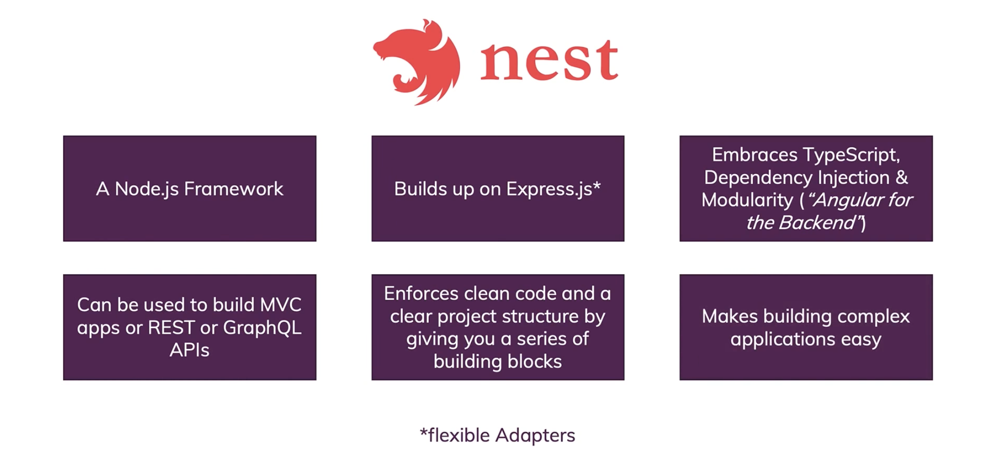

[](https://xtechnology.dev/)

<div class="twitter-btn">
  <a href="https://twitter.com/XTechnology5/status/1513973177768157200"><i></i></a>
</div>

# How to develop, build, and deploy Node.js NestJS GRPC microservices with Pulumi and Google Cloud Platform

The workshop gives a practical perspective of key principles needed to develop, build, and maintain a set of microservices in the Node.js stack. It covers specifics of creating isolated `TypeScript` dockerized services using NestJS framework and a monorepo approach with **turborepo**. The workshop includes an overview and a live exercise to create cloud environment with **Pulumi** framework and **Google Cloud Platform** services. The sessions fits the best developers who want to learn and practice build and deploy techniques using Google Cloud Platform stack and Pulumi, Node.js, and NestJS.

## General

- 2-3 hours
- Advanced level
- Technologies overview - Node.js, TypeScript, NestJS, GRPC, Pulumi, GCP, Docker, Kubernetes, turborepo
- Example structure - turborepo configuration, common utilities, demo services
- Practical exercise - create cloud environment and deploy microservices to a cluster

### Prerequisites

- Good understanding of JavaScript or TypeScript
- Experience with Node.js and writing Backend applications
- [Preinstall Node.js, npm](https://nodejs.org/en/download/)
- [Preinstall Docker](https://docs.docker.com/get-docker/), [docker-compose](https://docs.docker.com/compose/install/)
- [Preinstall Protocol Buffer Compiler](https://grpc.io/docs/protoc-installation/)
- We prefer to use VSCode for a better experience with JavaScript and TypeScript (other IDEs are also ok)
- todo @reddikh to add GCP

### Instructors

[Alex Korzhikov](https://twitter.com/AlexKorzhikov) & [Andrew Reddikh](https://twitter.com/AndrewRedUK)

### Materials

- [Repository](https://github.com/x-technology/micro-services-nestjs-infrastructure-pulumi-gcp)
- [Practical Exercises as Github Issues](https://github.com/x-technology/micro-services-nestjs-infrastructure-pulumi-gcp/issues)


# Workshop Begins!

## Agenda

- [Introduction](#introduction)
  - [Who are we?](#who-are-we)
  - [What are we going to do today?](#how-to-develop-build-and-deploy-nodejs-microservices-with-pulumi-and-azure-devops)
  - [Which technologies are we going to use?](#technologies)
- [Crypto 🦄 Currency Converter - Node.js](#crypto-currency-converter)
  - [What we're building](#what-were-building)
  - [Prerequisites](#prerequisites)
  - [Monorepo structure](#monorepo-structure)
  - [Using Turborepo](#using-lerna)
  - [What is GRPC?](#what-is-grpc)
  - [What are Protocol Buffers?](#what-are-protocol-buffers)
  - [Demo - Hello Node.js GRPC](#demo---hello-nodejs-grpc)
  - [Demo - Run Microservices Locally](#demo---all-microservices-locally)
  - [Nest Framework](#nest)
  - [Demo - All Together](#demo---all-together)

todo @reddikh
- [Infrastructure - Azure](#infrastructure---azure)
  - [Introduction to Azure](#introduction-to-azure)
- [Pulumi](#pulumi)
  - [Intro](#intro)
  - [Compared to Terraform?](#compared-to-terraform)
  - [Pulumi and Azure setup](#pulumi-and-azure-setup)
  - [Kubernetes Cluster](#kubernetes-cluster)
  - [Install ingress into kubernetes cluster](#install-ingress-into-kubernetes-cluster)
  - [DNS](#dns)
  - [Deploy Microservices](#deploy-microservices)
  - [Helm](#helm)
- [Practice](#practice)
- [Summary](#summary)

## Introduction

### Who are we?

#### Alex Korzhikov


Software Engineer, Netherlands

My primary interest is self development and craftsmanship. I enjoy exploring technologies, coding open source and enterprise projects, teaching, speaking and writing about programming - JavaScript, Node.js, TypeScript, Go, Java, Docker, Kubernetes, JSON Schema, DevOps, Web Components, Algorithms 👋 ⚽️ 🧑‍💻 🎧

- [AlexKorzhikov](https://twitter.com/AlexKorzhikov)
- [korzio](https://github.com/korzio)

#### Andrew Reddikh

[](https://andrew.red)

Software Engineer, United Kingdom

Passionate software engineer with expertise in software development, microservice architecture, and cloud infrastructure. On daily basis, I use Node.js, TypeScript, Golang, and DevOps best practices to build a better tech world by contributing to open source projects.

- [AndrewRedUK](https://twitter.com/AndrewRedUK)
- [mazahaca](https://github.com/mazahaca)

### What are we going to do today?

[⬆️ About](#agenda)

### Which technologies are we going to use?

[⬇️ Tags](#technologies)

## Crypto 🦄 Currency Converter - Node.js

### What we're building

We're building a currency converter, which can be used over gRPC calls.


Our intention is to send a request similar to `convert 0.345 ETH to CAD` and as a result we want to know the final amount in CAD and conversion rate.
We also assume that, it could be more than one currency provider, e.g.
1. Europe Central Bank rates
2. Bank of England rates
3. Crypto Rates

Here is how it works:
- **Currency Converter** fetches each of the provider, accumulates, and uses for conversion rates received from providers.
- **Currency Provider** is a proxy to gain single source of rates, it also converts rates into the common format defined in proto's.

### Prerequisites

#### 1. Checkout demo project

Let's get started from cloning demo monorepo

```shell
git clone git@github.com:x-technology/micro-services-nestjs-infrastructure-pulumi-gcp.git
```

#### 2. Install protoc

For efficient work with `.proto` format, and to be able to generate TypeScript-based representation of protocol buffers we need to install `protoc` library.

If you're a **MacOS user** and have [brew](https://brew.sh) package manager, the following command is the easiest way for installation:
```shell
brew install protobuf
# Ensure it's installed and the compiler version at least 3+
protoc --version
```

**For Linux users**

Run the following commands:

```shell
PROTOC_ZIP=protoc-3.14.0-linux-x86_64.zip
curl -OL https://github.com/protocolbuffers/protobuf/releases/download/v3.14.0/$PROTOC_ZIP
sudo unzip -o $PROTOC_ZIP -d /usr/local bin/protoc
sudo unzip -o $PROTOC_ZIP -d /usr/local 'include/*'
rm -f $PROTOC_ZIP
```

Alternately, manually download and install protoc from [here](https://github.com/protocolbuffers/protobuf/releases/download/v3.14.0/protoc-3.14.0-linux-x86_64.zip).

#### 3. Prepare environment

Make sure we have Node.js v14+ installed. If not, [nvm](https://github.com/nvm-sh/nvm#installing-and-updating) is a very good tool to install multiple node versions locally and easily switch between them.

Then we need to install dependencies within the monorepo.

```sh
npm install                 # turborepo and dependencies
```

Yay! 🎉 Now we're ready to go with the project.

### Monorepo structure

todo @alex
For better monorepo project management we used [Turborepo](https://turbo.build/repo/docs)

The project shapes into the following structure:

```sh
.
├── Dockerfile              # docker mono image
├── docker-compose.yaml     # docker-compose to start everything at once
├── docs                    # code examples
├── infrastructure          # pulumi and google cloud platform
├── node_modules            # common node modules
├── package.json            # project meta information & dependencies
├── packages                # microservices source code
└── turbo.json              # monorepo configuration
```

Let's move on 🚚

### Using Turborepo

Turborepo brings to the table generic configuration which can be easily applied across all/or filtered packages.

We use our common modules compiled to JavaScript, so before using it in services we need to build it first. The following commands executed `build` command against all common packages:

```json
// ./package.json
"scripts": {
  "build": "turbo run build",
  "start": "turbo run start:prod"
},
// ./turbo.json
"pipeline": {
  "build": {
    "dependsOn": ["^build"],
    "outputs": ["dist/**"]
  },
  "start:prod": {
    "cache": false
  }
}
```

```sh
npm run build
npm run start
curl http://localhost:3001/currency-converter/convert
```

### What is GRPC?

<a href="https://grpc.io/"></a>

<details><summary>gRPC Remote Procedure Calls, of course!</summary>


</details>

todo @alex

[](https://www.postman.com/state-of-api/api-technologies/#api-technologies)

> [gRPC](https://grpc.io/docs/what-is-grpc/faq/) is a *modern, open source* *remote procedure call (RPC)* framework that can run anywhere. It enables *client and server* applications to communicate transparently, and makes it easier to build connected systems


- March 2015 🗓
- Google ➡️ Open Source
- Standardize Microservices Architecture, Framework & Infrastructure


- Service Definitions (Protocol)
  - Protocol Buffers ⏭
- Client & Server
  - Generated Code (Stubs)
  - [10+ Languages](https://grpc.io/docs/languages/)
  - [Platforms & Environments](https://grpc.io/docs/platforms/) - Android, Web, Flutter
- Communication
- Authentication

```proto
// http://protobuf-compiler.herokuapp.com/
syntax = "proto3";

package hello;

service HelloService {
  rpc JustHello (HelloRequest) returns (HelloResponse);

  rpc ServerStream(HelloRequest) returns (stream HelloResponse);

  rpc ClientStream(stream HelloRequest) returns (HelloResponse);

  rpc BothStreams(stream HelloRequest) returns (stream HelloResponse);
}

message HelloRequest {
  string greeting = 1;
}

message HelloResponse {
  string reply = 1;
}
```


### What are Protocol Buffers?

*An efficient technology to serialize structured data*

```proto
message Person {
  string name = 1;
  int32 id = 2;
  bool has_ponycopter = 3;
}
```

> Does anyone know what numbers on the right side mean?

- [Protocol Buffers - Google Developers](https://developers.google.com/protocol-buffers/)
- [July 2008](https://github.com/protocolbuffers/protobuf/commit/40ee551715c3a784ea6132dbf604b0e665ca2def) 🗓
- Google ➡️ Open Source
- Typed `.proto` format
- Code Generation
  - `protoc` - the protocol buffers compiler
  - [10+ Languages](https://github.com/protocolbuffers/protobuf#protobuf-runtime-installation)
  - [Third-Party Add-ons for Protocol Buffers](https://github.com/protocolbuffers/protobuf/blob/master/docs/third_party.md)
- Services Description

```proto
syntax = "proto3";

package hello;

service HelloService {
  rpc SayHello (HelloRequest) returns (HelloResponse);
}

message HelloRequest {
  string greeting = 1;
}

message HelloResponse {
  string reply = 1;
}
```

### [Demo - Hello Node.js GRPC](https://github.com/x-technology/micro-services-nestjs-infrastructure-pulumi-gcp/tree/main/docs/demo-protobuf)

```json
// package.json
"scripts": {
  "1. download prices": "node index.js",
  "2. generate protobuf runtime": "protoc --js_out=import_style=commonjs,binary:. prices.proto",
  "3. run protobuf transformation": "node index.js",
  "4. start grpc server": "node grpc-server.js",
  "5. start grpc client": "node grpc-client.js"
}
```

### [Demo - Run Microservices Locally](https://github.com/x-technology/micro-services-infrastructure-pulumi-azure-devops)

- `./packages/common` - common libraries used in other project's services
- `./packages/services/grpc` - gRPC services we build to share the product
- `./proto` - proto files, which describe protocol of input/output and communication between the services
- `./node_modules` - dependencies, shared between all microservices
- `./lerna.json` - lerna's configuration file, defining how it should work with monorepo

```json
"workspaces": [
  "packages/common/*",
  "packages/services/grpc/*"
]
```

```js
const all = require('@common/go-grpc')
const client = new all.ecbProvider.EcbProviderClient('0.0.0.0:50051', all.createInsecure());
const response = await client.GetRates(new all.currencyProvider.GetRatesRequest())
response.toObject()
```

```js
// inside converter container
const all = require('@common/go-grpc')
const client = new all.currencyConverter.CurrencyConverterClient('0.0.0.0:50052', all.createInsecure());
const response = await client.Convert(new all.currencyConverter.ConvertRequest({ sellAmount: 100, sellCurrency: 'USD', buyCurrency: 'GBP' }));
response.toObject()
```

```bash
npm start
```

### [Nest Framework](https://nestjs.com/)


> A progressive Node.js framework for building efficient, reliable and scalable server-side applications

```ts
// modules
import { Module } from '@nestjs/common';
import { CatsModule } from './cats/cats.module';

@Module({
  imports: [CatsModule],
})
export class AppModule {}

// controllers
import { Controller, Get, Req } from '@nestjs/common';
import { Request } from 'express';

@Controller('cats')
export class CatsController {
  @Get()
  findAll(@Req() request: Request): string {
    return 'This action returns all cats';
  }
}
```



- [Nest Documentation](https://docs.nestjs.com/)
- `TypeScript` with Web Servers
  - `Angular` for Backend
  - Decorators, special types to control application flow
  - `Express` or `Fastify`
  - Modular & Testable
  - CLI
  - REST APIs, GRPC, GraphQL
  - Dependency Injection
  - Observables / RxJS
  - SOLID / DDD / AOP / CQRS


- Controllers
- Providers
- Modules
- Middleware
- Guards
- Pipes
- Interceptors

```ts
// @Body(), @Get(), @Post(), @Put(), @Delete(), @Patch(), @Options(), @Head(), @All()
@Get()
findAll(@Req() request: Request): string {
  return 'This action returns all cats';
}
```

### Demo - All Together

```bash
# speed run
npx @nestjs/cli new movies            # create new nestjs microservice
cd movies
npm run start

# or full log
rm -rf packages
rm -rf tmp
mv packages tmp
mv tmp packages
cd packages
mv packages monolith
npx @nestjs/cli new movies
cd movies
npm start

# root
cd ../../
git checkout demo-new-nestjs-module   # monorepo full example
npm install                           # run turborepo tasks
npm run build
npm start

# test
curl http://localhost:3000/
curl http://localhost:3001/

# see currency converter monolith project
curl http://localhost:3001/currency-converter/convert
```

#### [Issues](https://github.com/x-technology/micro-services-nestjs-infrastructure-pulumi-gcp/issues) - Practical Exercises

1. Attach [Swagger Plugin](https://docs.nestjs.com/openapi/introduction)

```bash
npm install --save @nestjs/swagger swagger-ui-express
```

2. Split `packages/monolith` into separate microservices.

Make sure `turborepo` configuration is updated, build and start all services

3. Fix type definitions inside controllers, why observable types are generated instead of Promises?

```ts
// packages/monolith/src/currency-converter/currency-converter.controller.ts
@Get('convert')
  async convert(): Promise<ConvertResponse> {
    // TODO fix type definitions
    const $rates = this.currencyConvertClient.Convert(ConvertRequest.fromJSON({
      sellAmount: 100,
      sellCurrency: 'USD',
      buyCurrency: 'GBP',
    }));

    const firstNumber = await firstValueFrom($rates as unknown as Observable<ConvertResponse>);
    const rates = firstNumber as unknown as ConvertResponse

    return rates
  }
```

---

todo @reddikh
## Infrastructure - Azure

### Introduction to Azure

*`Microsoft Azure` is a enourmous cloud ecosystem that enables to organize, develop, publish applications worldwide*

- Organization Resources - Users, Tasks
- CI/CD - Repositories, Pipelines, Artifacts
- Integrations

### Demo - [Migrate to Azure](https://dev.azure.com/xtechnology5/_git/XTechnology)

- Azure DevOps
  - Repository
- [Azure Container Registry](https://portal.azure.com/#@hellole.onmicrosoft.com/resource/subscriptions/8706d28d-203d-4127-ac6e-2ab12c9caf33/resourcegroups/xtechnology-microservices/providers/Microsoft.ContainerRegistry/registries/xtechnology/quickStart)

```bash
docker login xtechnology.azurecr.io
docker image tag tmp-base2:latest xtechnology.azurecr.io/microservices-united:latest
docker push xtechnology.azurecr.io/microservices-united:latest
```

- [Azure Pipelines](https://dev.azure.com/xtechnology5/XTechnology/_apps/hub/ms.vss-build-web.ci-designer-hub)
  - [Service Connections](https://dev.azure.com/xtechnology5/XTechnology/_settings/adminservices)
  - [Build and Push](https://dev.azure.com/xtechnology5/XTechnology/_build?definitionId=1&_a=summary)

## Pulumi
### Intro
Pulumi - Developer-First Infrastructure as Code

- Flexible and expressive
> Loops, conditionals, functions, classes, and more.

- Be productive
> Gets things done in seconds rather than hours.

- Share and reuse
> Define and consume patterns and practices to reduce boilerplate.


- Language: Python, TypeScript, JavaScript, Go, C#, F#
- Infrastructure Reuse and Modularity: Flexible. Reuse functions, classes, packages, and Pulumi components.
- Secrets are encrypted in transit and in the state file.


### Compared to Terraform?
Terraform is an open-source infrastructure as code software tool that provides a consistent CLI workflow to manage hundreds of cloud services.


- Language (HCL)
- Infrastructure Reuse and Modularity: Constrained. Can only reuse Terraform modules.
- Secrets are stored in a separate product (Vault). There is no way to encrypt them in the state file.

### Pulumi and Azure setup
Let's get started from pulumi installation and initial infrastructure repo setup.

1. Let's first install `azure-cli` with a command. If you're a MacOS user follow the [brew](https://brew.sh/) command.
```shell
brew install azure-cli
```

2. Next, we need to get `pulumi` cli installed.
```shell
brew install pulumi
```

3. Now it's time to create infrastructure project in `infra` folder with the following command.
```shell
pulumi new azure-typescript
```

4. Let's get authorized registered at Azure and Pulumi
- https://portal.azure.com
- https://app.pulumi.com

5. Get authorized in cli commands:
```shell
az login
pulumi login
```

6. Get dependencies installed in infrastructure folder
```shell
yarn install
```

7. Yay! Now we're ready to start coding our infrastructure straight away.

### Kubernetes Cluster
Let's get started with Kubernetes Cluster in Azure, and for this purpose we're going to use Pulumi to start.

We need to import a file, containing description of our cluster.
```typescript
import * as cluster from "./cluster";
import * as resourceGroup from "./resourceGroup";

export let clusterName = cluster.k8sCluster.name;
export let groupName = resourceGroup.resourceGroup.name;
```

Now, let's try to do a simple command to build our infrastructure in the cloud:
```shell
pulumi up
```

Let's check our cluster at the Azure website.
Great! It's there, just in few lines of TypeScript code.

### Registry

Now we're good to add docker registry, where we're going to put our application code as a Docker image.

Let's add the following lines into our `index.ts`:
```typescript
import { registry } from "./registry";

export let registryName = registry.loginServer;
```

Once again `pulumi up` to see it's deployed.

Now we can see our new registry created and here is the name of the registry in the output of pulumi command.
So, let's build our application code into a docker image and push it to newly created registry by the following commands:

Replace `registry-name` with real registry name from pulumi output.

```shell
az acr login --name registry-name
docker build -t registry-name.azurecr.io/grpc:latest .
docker push registry-name.azurecr.io/grpc:latest
```

Great the image is there in the cloud! It's ready to be installed from the cluster, or not yet?

We need to give reading permissions to our cluster, so it's allowed to pull images from registry.

```typescript
import * as azure from "@pulumi/azure";

const principalId = cluster.k8sCluster.identityProfile.apply(p => p!["kubeletidentity"].objectId!);
const assignment = new azure.authorization.Assignment("workshop-assignment", {
  principalId: principalId,
  roleDefinitionName: "AcrPull",
  scope: registry.id,
  skipServicePrincipalAadCheck: true,
});
```

### Install ingress into kubernetes cluster
**What is Ingress?**
Ingress exposes HTTP and HTTPS routes from outside the cluster to services within the cluster. Traffic routing is controlled by rules defined on the Ingress resource.


Let's add it with the following code:
```typescript
import * as k8s_system from "./k8s/system";

export let ingressServiceIP = k8s_system.ingressServiceIP;
```

Right after applying this code, we can see `ingressServiceIP` it's our public IP of the cluster.
Now let's attach DNS to this IP.

### DNS
We're going to use CloudFlare for DNS as it provides very rich api and also an extra features like Anti-Ddos and more.

```typescript
import * as dns from "./dns";

export let dnsRecord = dns.mainRecord.hostname;
```

Once again `pulumi up` to see the changes applied.

### Deploy Microservices

```typescript
import * as apps from "./k8s/apps";

export let currencyConverter = apps.currencyConverter.urn;
export let appNamespace = apps.appNamespace.metadata.name;
```

Get credentials for using `kubectl`
```shell
az aks get-credentials --admin --name workshop-cluster1437dadd -g workshop-group5e64df12
```

Let's create a proxy forwarding to our service inside the kubernetes cluster
```shell
kubectl port-forward -n apps-q0fg8ahd svc/currency-converter-grpc 50051:50051
```

Now it's the moment to call our currency-converter:
```shell
echo '{"sellCurrency": "GBP", "buyCurrency": "USD", "sellAmount": 150}' | grpcurl -plaintext -import-path ./proto -proto currency-converter.proto -d @ 127.0.0.1:50051 currencyConverter.CurrencyConverter.Convert
```

Great 🎉!

We've just created the full infrastructure and deployed our microservices into the Kubernetes cluster using Helm charts and pulumi.

### Helm

Helm is a package manager for Kubernetes. Helm is the K8s equivalent of yum or apt. Helm deploys charts, which you can think of as a packaged application.

We store our helm charts inside the `./infrastructure/charts` folder.

By running a command we can create a new helm chart:
```shell
helm create grpc
```

Helm also provides an ability to easily template our package, so we can provide multiple values into the chart, when we deploy it.

Following command will show us rendered a `yaml` definition of the helm chart
```shell
helm template grpc
```

## Practice

It's time to have some practice and evolve our services even more!

Let's grab a task based on the things you'd like to do 👇

- [Issues](https://github.com/x-technology/micro-services-infrastructure-pulumi-azure-devops/issues)

## Summary

- GRPC
- NestJS framework
  - Microservices Principles
- Pulumi
  - Compare to Terraform

## Feedback

Please [share your feedback](https://forms.gle/8UcN6H1VaWtekCaPA) on our workshop. Thank you and have a great coding!

If you like the workshop, you can become our [patron](https://www.patreon.com/xtechnology), yay! 🙏

## Links

- [Protocol Buffers Crash Course](https://youtu.be/46O73On0gyI)
- [gRPC Crash Course - Modes, Examples, Pros & Cons and more](https://www.youtube.com/watch?v=Yw4rkaTc0f8)
- [NestJS Microservices - 4 - Using gRPC](https://www.youtube.com/watch?v=OuyxRE9xLw4)
- [NestJS](https://docs.nestjs.com/)
- [Dependency Injection](https://docs.nestjs.com/fundamentals/dependency-injection)
- [Monolith](https://microservices.io/patterns/monolithic.html)
- [Prereqiuisites and principles](https://martinfowler.com/bliki/MicroservicePrerequisites.html)


### Technologies

microservices
pulumi
google cloud platform
devops
node.js
nestjs
javascript
protobuf
grpc
typescript
lerna
npm
yarn
docker
git
architecture
crypto
currency

<style type="text/css">
  h1:first-child {
    display: none;
  }

  img[alt="andrew reddikh"] {
    filter: grayscale(100%);
  }

  img[alt="microservices graph"] {
    width: 500px;
  }
  /* twitter button */
  .twitter-btn {
    width: 200px;
    display: inline-block;
    overflow: hidden;
    text-align: left;
    white-space: nowrap;
    vertical-align: top:
    zoom: 1;
    font-size: 13px;
    line-height: 26px;
    font-family: "Helvetica Neue",Arial,sans-serif;
  }
  .twitter-btn a {
    height: 28px;
    padding: 1px 10px 1px 9px;
    border-radius: 4px;
    position: relative;
    font-weight: 500;
    color: #fff;
    cursor: pointer;
    background-color: #1b95e0;
    border-radius: 3px;
    box-sizing: border-box;
    display: inline-block;
    text-decoration: none;
  }
  .twitter-btn a:hover {
    background-color: #0c7abf;
  }
  .twitter-btn a i {
    width: 18px;
    height: 18px;
    top: 4px;
    position: relative;
    display: inline-block;
    background: transparent 0 0 no-repeat;
    background-image: url(data:image/svg+xml,%3Csvg%20xmlns%3D%22http%3A%2F%2Fwww.w3.org%2F2000%2Fsvg%22%20viewBox%3D%220%200%2072%2072%22%3E%3Cpath%20fill%3D%22none%22%20d%3D%22M0%200h72v72H0z%22%2F%3E%3Cpath%20class%3D%22icon%22%20fill%3D%22%23fff%22%20d%3D%22M68.812%2015.14c-2.348%201.04-4.87%201.744-7.52%202.06%202.704-1.62%204.78-4.186%205.757-7.243-2.53%201.5-5.33%202.592-8.314%203.176C56.35%2010.59%2052.948%209%2049.182%209c-7.23%200-13.092%205.86-13.092%2013.093%200%201.026.118%202.02.338%202.98C25.543%2024.527%2015.9%2019.318%209.44%2011.396c-1.125%201.936-1.77%204.184-1.77%206.58%200%204.543%202.312%208.552%205.824%2010.9-2.146-.07-4.165-.658-5.93-1.64-.002.056-.002.11-.002.163%200%206.345%204.513%2011.638%2010.504%2012.84-1.1.298-2.256.457-3.45.457-.845%200-1.666-.078-2.464-.23%201.667%205.2%206.5%208.985%2012.23%209.09-4.482%203.51-10.13%205.605-16.26%205.605-1.055%200-2.096-.06-3.122-.184%205.794%203.717%2012.676%205.882%2020.067%205.882%2024.083%200%2037.25-19.95%2037.25-37.25%200-.565-.013-1.133-.038-1.693%202.558-1.847%204.778-4.15%206.532-6.774z%22%2F%3E%3C%2Fsvg%3E);
  }
  .twitter-btn a span {
    margin-left: 4px;
    white-space: nowrap;
    display: inline-block;
    vertical-align: top;
    zoom: 1;
  }

  img:not([alt*=XTechnology]) {
    max-width: 450px !important;
  }

  img[alt*="photo"] {
    max-width: 250px !important;
    -webkit-filter: grayscale(100%); /* Safari 6.0 - 9.0 */
    filter: grayscale(100%);
  }
</style>