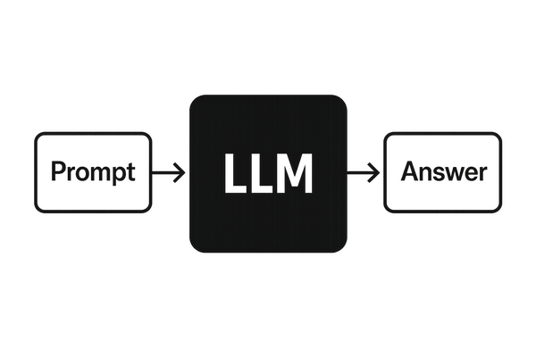
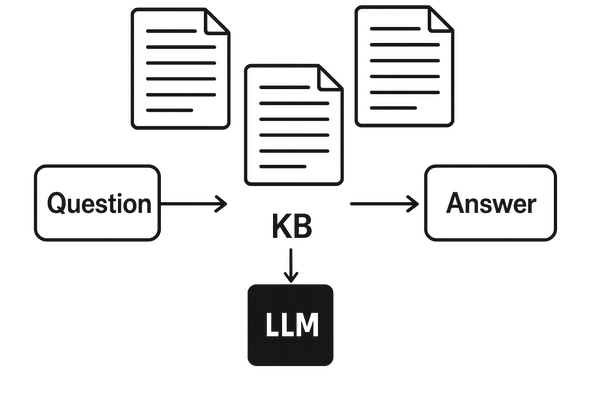
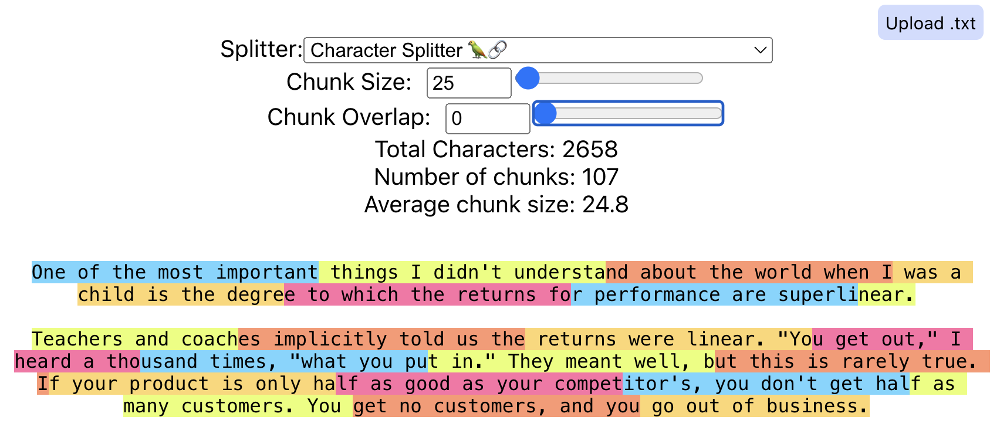
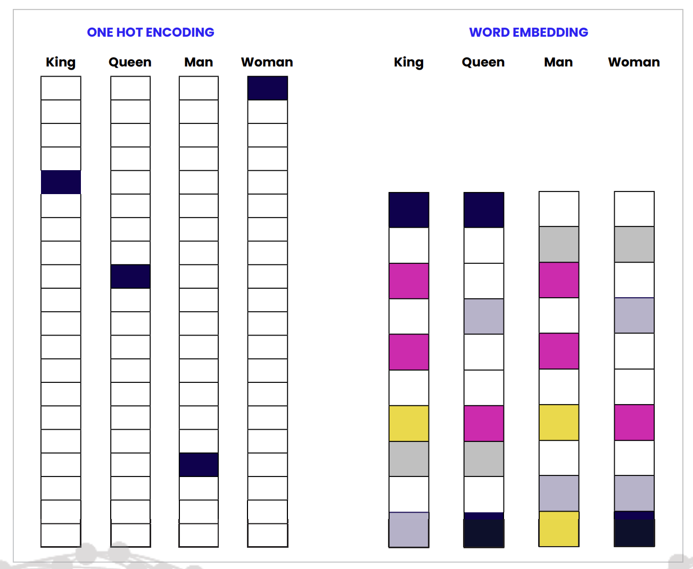
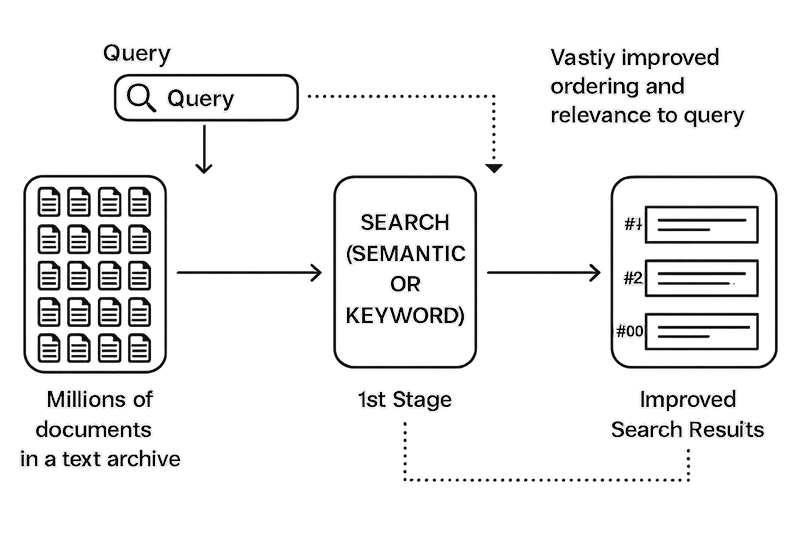
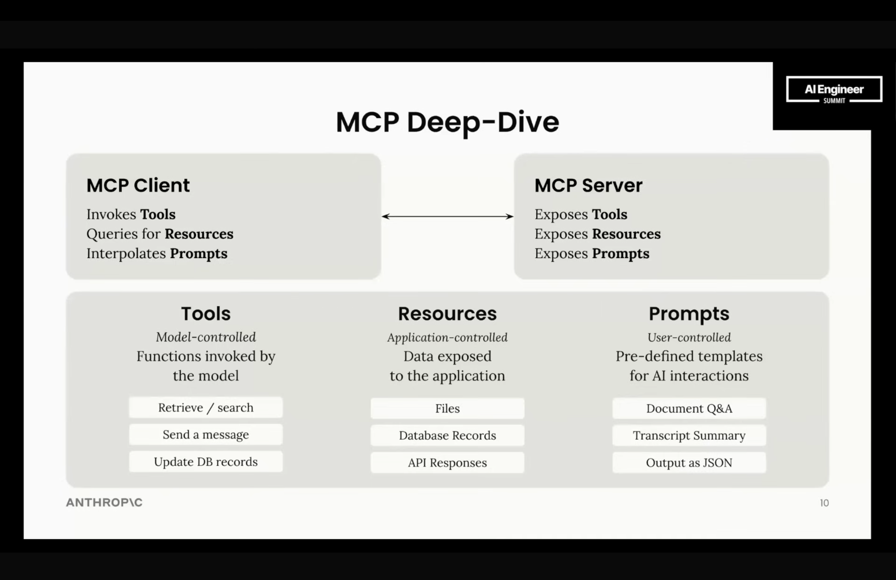
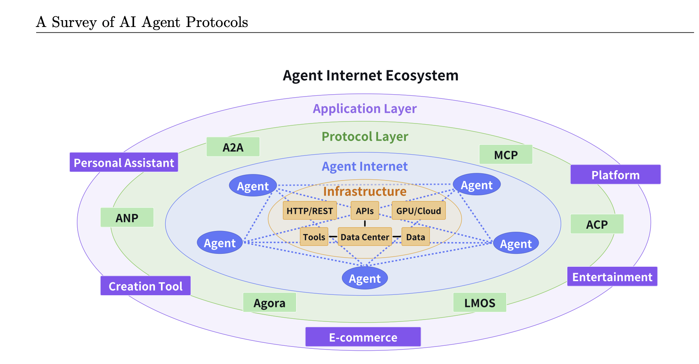
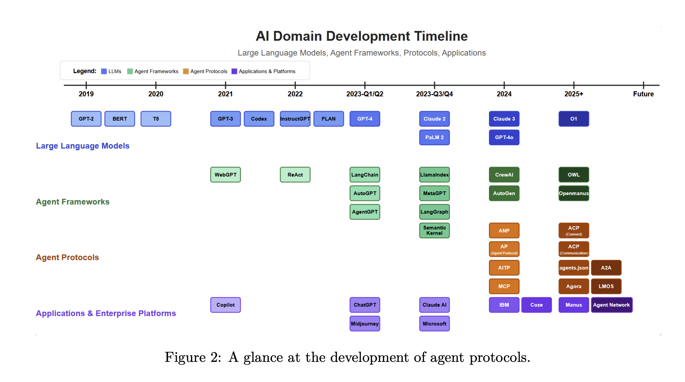
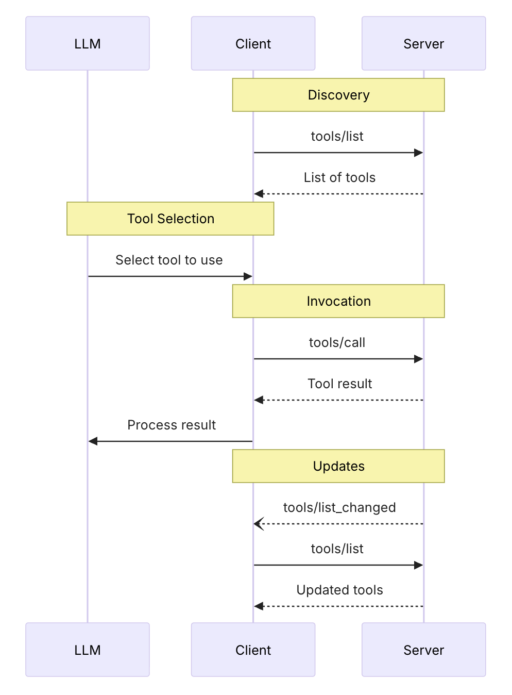
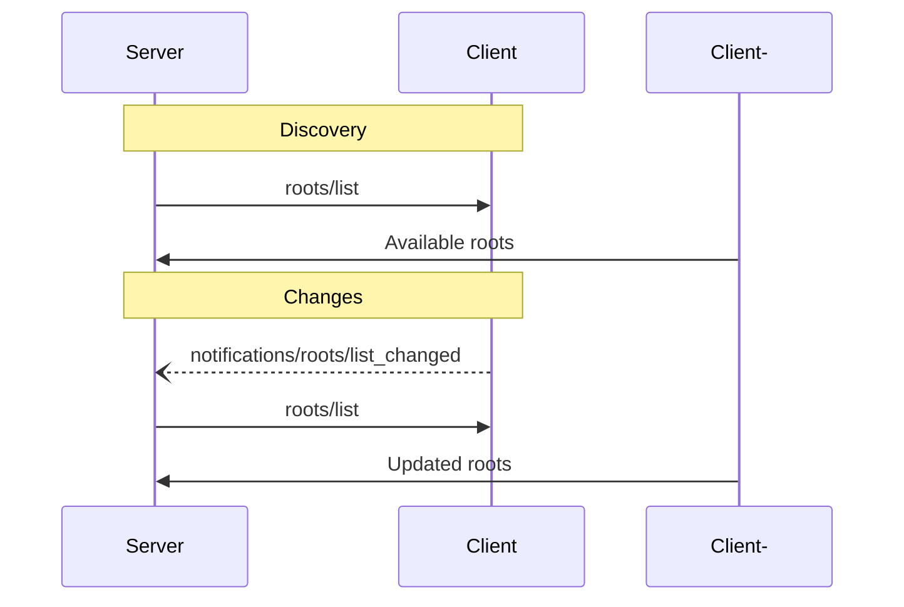

[](https://xtechnology.dev/)

<style type="text/css">
  h1:first-child {
    display: none;
  }

  img[alt="autonomous agent 2023"],img[alt="alt text"],img[alt="function call flow"],img[alt="inspector"], img[alt="text splitter example"], img[alt="embeddings vs indexing"], img[alt="embedding space"], img[alt="what are embedding models"], img[alt="RAG Triad"], img[alt="reranking process"] {
    width: 500px;
    max-height: 600px;
  }
  /* twitter button */
  .twitter-btn {
    width: 200px;
    display: inline-block;
    overflow: hidden;
    text-align: left;
    white-space: nowrap;
    vertical-align: top:
    zoom: 1;
    font-size: 13px;
    line-height: 26px;
    font-family: "Helvetica Neue",Arial,sans-serif;
  }
  .twitter-btn a {
    height: 28px;
    padding: 1px 10px 1px 9px;
    border-radius: 4px;
    position: relative;
    font-weight: 500;
    color: #fff;
    cursor: pointer;
    background-color: #1b95e0;
    border-radius: 3px;
    box-sizing: border-box;
    display: inline-block;
    text-decoration: none;
  }
  .twitter-btn a:hover {
    background-color: #0c7abf;
  }
  .twitter-btn a i {
    width: 18px;
    height: 18px;
    top: 4px;
    position: relative;
    display: inline-block;
    background: transparent 0 0 no-repeat;
    background-image: url(data:image/svg+xml,%3Csvg%20xmlns%3D%22http%3A%2F%2Fwww.w3.org%2F2000%2Fsvg%22%20viewBox%3D%220%200%2072%2072%22%3E%3Cpath%20fill%3D%22none%22%20d%3D%22M0%200h72v72H0z%22%2F%3E%3Cpath%20class%3D%22icon%22%20fill%3D%22%23fff%22%20d%3D%22M68.812%2015.14c-2.348%201.04-4.87%201.744-7.52%202.06%202.704-1.62%204.78-4.186%205.757-7.243-2.53%201.5-5.33%202.592-8.314%203.176C56.35%2010.59%2052.948%209%2049.182%209c-7.23%200-13.092%205.86-13.092%2013.093%200%201.026.118%202.02.338%202.98C25.543%2024.527%2015.9%2019.318%209.44%2011.396c-1.125%201.936-1.77%204.184-1.77%206.58%200%204.543%202.312%208.552%205.824%2010.9-2.146-.07-4.165-.658-5.93-1.64-.002.056-.002.11-.002.163%200%206.345%204.513%2011.638%2010.504%2012.84-1.1.298-2.256.457-3.45.457-.845%200-1.666-.078-2.464-.23%201.667%205.2%206.5%208.985%2012.23%209.09-4.482%203.51-10.13%205.605-16.26%205.605-1.055%200-2.096-.06-3.122-.184%205.794%203.717%2012.676%205.882%2020.067%205.882%2024.083%200%2037.25-19.95%2037.25-37.25%200-.565-.013-1.133-.038-1.693%202.558-1.847%204.778-4.15%206.532-6.774z%22%2F%3E%3C%2Fsvg%3E);
  }
  .twitter-btn a span {
    margin-left: 4px;
    white-space: nowrap;
    display: inline-block;
    vertical-align: top;
    zoom: 1;
  }

  img[alt*="photo"] {
    max-width: 250px !important;
  }
</style>

<div class="twitter-btn">
  <a href="https://twitter.com/XTechnology5/status/1662440871936114688"><i></i></a>
</div>

# Building a RAG System in Node.js: Vector Databases, Embeddings & Chunking

Large Language Models (LLMs) are powerful, but they often lack real-time knowledge. Retrieval-Augmented Generation (RAG) bridges this gap by fetching relevant information from external sources before generating responses. In this workshop, we’ll explore how to build an efficient RAG pipeline in Node.js using RSS feeds as a data source. We’ll compare different vector databases (FAISS, pgvector, Elasticsearch), embedding methods, and testing strategies. We’ll also cover the crucial role of chunking—splitting and structuring data effectively for better retrieval performance.

## Prerequisites

- Good understanding of JavaScript or TypeScript
- Experience with Node.js and API development
- Basic knowledge of databases and LLMs is helpful but not required

## Code

- [RAG Workshop](https://github.com/x-technology/rag-workshop)

## Agenda

- [Introduction 📢](#introduction)
- [About Everything 🌎](#about-everything)
- [Setup 🛠️](#setup)
- [Demo #1 - Hello World 👋](#Demo-1---hello-world)
- [Use Case - Exploring Node.js News 📰](#use-case---exploring-nodejs-news)
- [Chunking ✂️](#chunking)
- [Demo #2 - Chunking 🧩](#Demo-2---chunking)
- [Store & Retrieve 🗂️](#store--retrieve)
- [Demo #3 - Store & Retrieve 🔍](#Demo-3---store--retrieve)
- [Reranking 🥇](#reranking)
- [Evaluation 📊](#evaluation)
- [Demo #4 - Evaluation 🧪](#Demo-4---evaluation)
- [MCP World 🌎](#mcp-world)
- [Demo #5 - MCP ⛵️](#Demo-5---mcp)
- [Summary 📚](#summary)
- [Feedback 💬](#feedback)
- [Links 🔗](#links)

## Introduction

<!-- disclaimers: we are not DS, focus on usage, introduce high level and black box context -->

- Explore RAG's scope, architecture and components
- Demo various RAG aspects with chosen technologies
- Feedback & evaluate

### Alex Korzhikov


Software Engineer, Netherlands

My primary interest is self development and craftsmanship. I enjoy exploring technologies, coding open source and enterprise projects, teaching, speaking and writing about programming - JavaScript, Node.js, TypeScript, Go, Java, Docker, Kubernetes, JSON Schema, DevOps, Web Components, Algorithms 🎧 ⚽️ 💻 👋 ☕️ 🌊 🎾

- [AlexKorzhikov](https://www.linkedin.com/in/alex-korzhikov-8614011a/)
- [korzio](https://github.com/korzio)

### Pavlik Kiselev


Software Engineer, Netherlands

JavaScript developer with full-stack experience and frontend passion. He happily works at ING in a Fraud Prevention department, where helps to protect the finances of the ING customers.

- [Pavlik Kiselev](https://www.linkedin.com/in/pavlik-kiselev-06993347/)
- [paulcodiny](https://github.com/paulcodiny)

## About Everything

### Generative Artificial Intelligence (GenAI)

Use of Artificial Intelligence to produce human consumable content in **text**, image, audio, video format.

### Language Model (LM)

Language Models are Machine Learning models trained on natural language resources and aim predict next word based on given context.

LM relevant tasks - summarization, Q&A, classification, and more.

### Large Language Model (LLM)

Artificial Intelligence is powered by Large Language Models - models trained on tons of sources and materials, having billions of parameters.



### Retrieval Augmented Generation (RAG)

RAG is a method that combines information retrieval with language model generation.



Indexing = Offline

Retrieval = Search

Generation = LLM

Use Cases:

- Chat with user
- Analyze and summarise documents

```js
async function rag(q) {
  const results = await search(q)
  const prompt = makePrompt(q, results)
  const answer = await llm(prompt)
  return answer
}
```

<details><summary>Why do we need RAG?</summary>
- Additional, specific knowledge<br>
- Reduce hallucinations<br>
- Control system costs<br>
</details>

<details><summary>Why can't we just put all context in our LLM and ask it about?</summary>
- Cost<br>
- Slow<br>
- Size<br>
- Noize<br>
</details>

<details><summary>What do we need to build a RAG?</summary>
- Application (backend)<br>
- Search system (vector databases)<br>
- LLM (blackbox)<br>
</details>

### [Langchain](https://js.langchain.com/docs/introduction/) 🦜️🔗

> LangChain is a Python and JavaScript framework that brings flexible abstractions and AI-first toolkit for developers to build with GenAI and integrate your applications with LLMs. It includes components for abstracting and chaining LLM prompts, configure and use vector databases (for semantic search), document loaders and splitters (to analyze documents and learn from them), output parsers, and more.

## Setup

- Node.js
- Ollama / OpenAI
- `npm i langchain`

## Demo #1 - Hello World

```js
ollama.chat({
  messages: [
    { role: "user", content: "What is retrieval-augmented generation?" },
  ],
});
```

## Use Case - Exploring Node.js News

<video width="50%" height="500px" controls>
  <source src="https://framerusercontent.com/assets/Syj9M1soD3kB2EvO4GeoATDATI.mp4" type="video/mp4">
  Your browser does not support the video tag.
</video>

We aim to understand what happened in the Node.js community over the past year. To achieve this, we:

1. Collect and process news, popular blog posts, and articles
2. Store the documents in a database
3. Analyze and query the documents by asking targeted questions

<iframe src="https://atlas.nomic.ai/data/todexex279/nodejs-v4-2024/map" width="50%" height="500px"></iframe>

### How do we find sources?

- Own collection
- Ask ChatGPT <i>What are the best online resource to follow on Node.js news? Output urls and short description</i>

### How do we scrap articles?

- Direct fetch requests
- Run browser and navigate to urls
- Use external [services](https://console.apify.com/actors/tasks/mhbgzDv598tdTbltb/input)

### Some scrapping and text quality problems

- Paywalls
- Anti-bot protections
  - Cat & mouse game
- [Noise](https://github.com/x-technology/tech-people-stats/tree/feat/js-langchain/experiments/nodejs-v2/text-links-dataset_ai-web-scraper---extracted-urls-v2_2024-01-13_15-46-37-422.json) (marketing texts, tags, js, css)
  - Clean & parse
  - Noise reduction [algorithms](https://github.com/x-technology/tech-people-stats/blob/feat/js-langchain/langchain/parse-body.js)

### [Articles](https://github.com/x-technology/rag-workshop/blob/main/assets/articles.json)

- What dataset do you have?
- Which format do you need to parse?
- What are the most often queries?

## Chunking

### To chunk or not to chunk?

[](https://python.langchain.com/docs/concepts/text_splitters/)

> Chunking involves breaking down texts into smaller, manageable pieces called "chunks". Each chunk becomes a unit of information that is vectorized and stored in a database, fundamentally shaping the efficiency and effectiveness of natural language processing tasks.

- Normalize documents
- Reduce context (latency, LLM usage & cost)
- Enhance retrieval precision

### How do we split documents?

[](https://chunkviz.up.railway.app/)

- Chunk Size
> The number of characters we would like in our chunks. 50, 100, 100,000, etc.

- Chunk Overlap
> The amount we would like our sequential chunks to overlap. This is to try to avoid cutting a single piece of context into multiple pieces. This will create duplicate data across chunks.

- Length-based (`CharacterTextSplitter`) - Easy & Simple, don't take into account the text's structure

- Character/Token [splitters](https://textsplittervisualizer.com/)

```js
const { CharacterTextSplitter } = require("@langchain/textsplitters")
const textSplitter = new CharacterTextSplitter({
  chunkSize: 100,
  chunkOverlap: 0,
})
const texts = await textSplitter.splitText(document)
```

- Text-structured based (`RecursiveCharacterTextSplitter`)

- What split characters do you think [are included](https://github.com/langchain-ai/langchain/blob/9ef2feb6747f5a69d186bd623b569ad722829a5e/libs/langchain/langchain/text_splitter.py#L842) in Langchain by default?

- [Document-structured based](https://python.langchain.com/docs/how_to/code_splitter/)

- Semantic meaning based - [Extract Propositions](https://chentong0.github.io/factoid-wiki/)

- Agentic Chunking
  - Summarize text, propositions, images
  - Generate hypothetical questions
  - [Multiple embeddings](https://js.langchain.com/docs/how_to/multi_vector/)

## Demo #2 - Chunking
```js
const { RecursiveCharacterTextSplitter } = require("@langchain/textsplitters");
const splitter = new RecursiveCharacterTextSplitter({
  chunkSize: 100,
  chunkOverlap: 0,
});

return await splitter.splitText(text);
```

## Store & Retrieve


- Semantic VS Keyword Search

### To embed or not?

An embedding is a vector representation of data in embedding space (projecting the high-dimensional space of initial data vectors into a lower-dimensional space).



<!-- https://en.wikipedia.org/wiki/Maximum_inner-product_search
SVD
ANN algorithms -->


Vectors are stored in a database, which compare them as a way to search for data that is similar in meaning (by using [dot product](https://en.wikipedia.org/wiki/Dot_product) or [cosine](https://en.wikipedia.org/wiki/Cosine_similarity) measurement).

[](https://developers.google.com/machine-learning/crash-course/embeddings/embedding-space)

- [Ollama supported embedding models](https://ollama.com/search?c=embedding)

<details><summary>Can we exchange embedding models with equal vector dimensions?</summary>
- Nope, also embedding models evolve over time<br>

</details>

## Demo #3 - Store & Retrieve
```js
await Chroma.fromTexts(
  texts,
  { id: Array.from({ length: texts.length }, (_, i) => `chunk-${i}`) },
  embeddings,
  { collectionName: "rag_node_workshop_articles" },
);
```
## Reranking



> Rerankers analyze the initial search output and adjust the ranking to better match user preferences and application requirements

- Improve quality (other models and more context involved)
- Cost considerations
- Vector VS LLM based

## Evaluation


> Evaluate RAG the retriever and generator of a RAG pipeline separately

### Retriever

Hyperparameters:
- Database
- Embedding model
- Chunk size
- Top-K documents
- LLM temperature
- Prompt template
- Reranking model
- etc.

> Does your reranker model ranks the retrieved documents in the "correct" order?

Metrics:
- Precision - whether documents in the retrieved context that are relevant to the given input are ranked higher than irrelevant ones
- Recall - how well the retrieved context aligns with the expected output, or if all relevant documents are retrieved
<!-- > also used in embedding models evaluation -->

### Generation

Hyperparameters:
- Prompt template
- LLM

> Can we use a smaller, faster, cheaper LLM?

Metrics:
- Faithfulness / Groundedness - whether the actual output factually aligns with the retrieved context
- Answer relevancy - how relevant the actual output is to the provided input

### Frameworks

- [DeepEval](https://docs.confident-ai.com/)
- [TruLens](https://www.trulens.org/)
- [Ragas](https://docs.ragas.io/en/latest/getstarted/)

### Our choice

- Hit Rate (HR) or Recall at k:
Measures the proportion of queries for which at least one relevant document is retrieved in the top k results.

- Mean Reciprocal Rank (MRR):
Evaluates the rank position of the first relevant document.

- Chunk attributions/utilization - if chunk contributed to model/rag response

- What low numbers might show us?
- How do we define numbers?

## Demo #4 - Evaluation
```js
const relevantDocs = await getRelevantDocuments(vectorStore, summary);
const relevance = relevantDocs.map((d) => d.pageContent === chunk);
console.log(hitRate(relevance));
```

## MCP World

- AI agents

[](https://lilianweng.github.io/posts/2023-06-23-agent/)

> AI agents are AI programs built on top of LLMs. They use LLM information-processing capabilities to obtain data, make decisions, and take actions on behalf of human users.

- [AI SDK Vercel](https://ai-sdk.dev/docs/introduction)

<!-- > Agents are AI systems that can:
>
> Make decisions about what actions to take
> Use tools to accomplish tasks
> Maintain state and context
> Learn from previous interactions
> Work towards specific goals
> Agentic flow is not necessarily a completely independent agent, but it can still make some decisions during the flow execution
>
> A typical agentic flow consists of:
>
> Receiving a user request
> Analyzing the request and available tools
> Deciding on the next action
> Executing the action using appropriate tools
> Evaluating the results
> Either completing the task or continuing with more actions
> The key difference from basic RAG is that agents can:
>
> Make multiple search queries
> Combine information from different sources
> Decide when to stop searching
> Use their own knowledge when appropriate
> Chain multiple actions together
>
> So in agentic RAG, the system
> has access to the history of previous actions
> makes decisions independently based on the current information and the previous actions


https://www.anthropic.com/engineering/building-effective-agents

> "Agent" can be defined in several ways. Some customers define agents as fully autonomous systems that operate independently over extended periods, using various tools to accomplish complex tasks. Others use the term to describe more prescriptive implementations that follow predefined workflows. At Anthropic, we categorize all these variations as agentic systems, but draw an important architectural distinction between workflows and agents:

Workflows are systems where LLMs and tools are orchestrated through predefined code paths.
Agents, on the other hand, are systems where LLMs dynamically direct their own processes and tool usage, maintaining control over how they accomplish tasks.

> MCP is one way for AI agents to find the information they need and to take actions. It helps connect AI agents to the "outside world," so to speak — the world beyond the LLM's training data. (Other methods include API integrations and headless browsing.)

> an LLM agent typically consists of:
> - Foundation Model,  typically a large language model or a multimodal large model,
which provides essential capabilities for reasoning, understanding language, and interpreting multimodal information
> - Memory Systems: LLM agents implement both short-term and long-term memory components to maintain context across interactions and store relevant information for future use
> - Planning: Planning is a fundamental aspect of agent research (), enabling agents to break down complex tasks into smaller, manageable subtasks
> - Tool-Using: Although LLMs inherently face limitations in mathematical reasoning, logical operations, and knowledge beyond their trained corpus, agents overcome these constraints by integrating external tools and APIs
> - Action Execution: The ability to interact with their environment by executing actions, whether through API calls, database queries, or interaction
with external systems.

-->

- Agents vs Workflows

- Agent Protocols

> Agent protocols are standardized frameworks that define the rules, formats, and procedures for structured communication among agents and between agents and external systems

- [Agent-to-Agent (A2A)](https://github.com/a2aproject/A2A)
- [ANP - Agent Network Protocol](https://www.agent-network-protocol.com/)

[](https://arxiv.org/abs/2504.16736)

[](https://arxiv.org/abs/2504.16736)

- MCP - Model Context Protocol

Anthropic, November 2024, [Specification](https://modelcontextprotocol.io/specification/2025-06-18#overview)

> MCP provides a standardized way for applications to:
> - Share contextual information with language models
> - Expose tools and capabilities to AI systems
> - Build composable integrations and workflows

<!-- > MCP is a universal and open context-oriented protocol for connecting LLM agents to resources consisting of external data, tools and services in a simpler and more reliable way -->

based on [the Function calling flow](https://platform.openai.com/docs/guides/function-calling)

```js
for (const toolCall of response.output) {
  if (toolCall.type !== "function_call") {
    continue
  }

  const name = toolCall.name
  const args = JSON.parse(toolCall.arguments)

  const result = callFunction(name, args)
  input.push({
    type: "function_call_output",
    call_id: toolCall.call_id,
    output: result.toString(),
  })
}
```

[Features](https://modelcontextprotocol.io/specification/2025-06-18#features)
- Resources: Context and data, for the user or the AI model to use
- Prompts: Templated messages and workflows for users
- [Tools](https://platform.openai.com/docs/guides/tools): Functions for the AI model to execute
- Communication Layer: Authentication, Notifications, [JSON-RPC](https://www.jsonrpc.org/specification)
- [Servers](https://github.com/modelcontextprotocol/servers)



<!-- 

Clients on AI Agents (host applications) <-> MCP Servers

Clients mainatin connection with servers




> In the initial phase of a complete MCP invocation cycle, when faced with a user query, the host employs the LLMs’ understanding and reasoning capabilities to infer the context necessary to formulate a response to the query. Concurrently, the multiple clients connected to the host provide natural language descriptions of the available resources. Based on the information available, the host determines which resources to request context from and initiating a strategic context request to the corresponding client. In the request phase of the MCP invocation cycle, the client sends an executive context request to the corresponding server, encompassing operations such as data modifications or tool invocations. Upon receiving the client’s request, the server operates on the resources as specified and subsequently transmits the obtained context to the client, which then passes it on to the host. In the response phase of the MCP cycle, the host combines the context obtained to formulate a reply to the user query, thereby completing the cycle.

> [ ] is it right that tool_use is detected by LLM?
https://blog.langchain.com/mcp-fad-or-fixture/

> A function or tool refers in the abstract to a piece of functionality that we tell the model it has access to. As a model generates a response to a prompt, it may decide that it needs data or functionality provided by a tool to follow the prompt's instructions.
> You could give the model access to tools that:
> Get today's weather for a location
> Access account details for a given user ID
> Issue refunds for a lost order
> Or anything else you'd like the model to be able to know or do as it responds to a prompt.
> When we make an API request to the model with a prompt, we can include a list of tools the model could consider using. For example, if we wanted the model to be able to answer questions about the current weather somewhere in the world, we might give it access to a get_weather tool that takes location as an argument.

-->


```json
{
  "name": "get_weather_data",
  "title": "Weather Data Retriever",
  "description": "Get current weather data for a location",
  "inputSchema": {
    "type": "object",
    "properties": {
      "location": {
        "type": "string",
        "description": "City name or zip code"
      }
    },
    "required": ["location"]
  },
  "outputSchema": {
    "type": "object",
    "properties": {
      "temperature": {
        "type": "number",
        "description": "Temperature in celsius"
      },
      "conditions": {
        "type": "string",
        "description": "Weather conditions description"
      },
      "humidity": {
        "type": "number",
        "description": "Humidity percentage"
      }
    },
    "required": ["temperature", "conditions", "humidity"]
  }
}
```

<!-- > Tools let LLMs take actions through your server. Tools can perform computation, fetch data and have side effects. Tools should be designed to be model-controlled - i.e. AI models will decide which tools to call, and the arguments

- [ResourceLink](https://modelcontextprotocol.io/specification/2025-06-18/server/tools#resource-links)

- resources
- prompts
- notifications


```json
{
  jsonrpc: "2.0";
  id: string | number;
  method: string;
  params?: {
    [key: string]: unknown;
  };
}
```

  - Streamable HTTP transport
  - stdio
  - sse
- Lifecycle Management: Connection initialization, capability negotiation, and session control
- Authorization: Authentication and authorization framework for HTTP-based transports
-->

[Development Process Example](https://github.com/modelcontextprotocol/typescript-sdk?tab=readme-ov-file#quick-start)
- [SDK](https://github.com/modelcontextprotocol/typescript-sdk)
- Server

```bash
npx -y tsx 4-mcp.ts
```

- [Client](https://modelcontextprotocol.io/docs/develop/build-client#node)

- vscode github copilot
- vscode openai codex

```json
// vscode settings.json
"my-server": {
  "type": "http",
  "url": "http://localhost:3000/mcp"
}
```

```toml
# codex config
[mcp_servers.my-server]
url = "http://localhost:3000/mcp"
```

- MCP inspector

```bash
npx @modelcontextprotocol/inspector
```


- What are components in the agent of our system?
- What can you do with MCPs locally?

<!--
- Attach to agentic product demo?
- Artificial layer, why not to introduce default mcp for any potential API?
https://github.com/alexeygrigorev/rag-agents-workshop
-->

## Demo #5 - MCP

```js
const client = new Client({
  name: "rag-workshop-mcp-client",
  version: "1.0.0",
})

// Call a tool
const result = await client.callTool({
  name: "get_documents",
  arguments: {
    q: "What's terraform used for?",
  },
})
```

## Summary

The workshop overviews and samples RAG system architecture in Node.js, connecting data ingestion, embedding, and retrieval layers into a unified pipeline. It explores how the RAG pattern enhances LLMs with external knowledge, improving accuracy and adaptability in real-world applications.

## Feedback

Please [share your feedback](https://app.sli.do/event/wV641HGAr8jeVnULeLAAg2) on the workshop. Thank you and have a great coding!

<iframe src="https://wall.sli.do/event/wV641HGAr8jeVnULeLAAg2/?section=fdc6bb93-244d-4320-ac2d-cd6a3ffd6a38" width="50%" height="500px"></iframe>

If you like the workshop, you can become our [patron](https://www.patreon.com/xtechnology), yay! 🙏

## Links

- [Mete Atamel - A blog about software development and more](https://atamel.dev/)
- [Build a Retrieval Augmented Generation (RAG) App](https://js.langchain.com/docs/tutorials/rag/)
- [5 Levels Of Text Splitting](https://github.com/FullStackRetrieval-com/RetrievalTutorials/blob/main/tutorials/LevelsOfTextSplitting/5_Levels_Of_Text_Splitting.ipynb)
- [LlamaIndex - End-to-end tooling to ship a context-augmented AI agent to production](https://llama-playground.vercel.app/)
- [Ragas - Ultimate toolkit for evaluating and optimizing Large Language Model (LLM) applications.](https://github.com/explodinggradients/ragas)
- [deepeval - the open-source LLM evaluation framework](https://docs.confident-ai.com/)
- [LLM Zoomcamp - A Free Course on Real-Life Applications of LLMs](https://github.com/DataTalksClub/llm-zoomcamp)
- [Machine Learning Crash Course](https://developers.google.com/machine-learning/crash-course/embeddings/)
- [DeepEval - RAG Evaluation](https://docs.confident-ai.com/guides/guides-rag-evaluation)
- [Cohere - Say Goodbye to Irrelevant Search Results: Cohere Rerank Is Here](https://cohere.com/blog/rerank)
- [5-Day Gen AI Intensive Course with Google Learn Guide](https://www.kaggle.com/learn-guide/5-day-genai)
- [MCP: Build Rich-Context AI Apps with Anthropic](https://learn.deeplearning.ai/courses/mcp-build-rich-context-ai-apps-with-anthropic/)
- [A Survey of AI Agent Protocols](https://arxiv.org/abs/2504.16736)
- [Lilian Weng - LLM Powered Autonomous Agents](https://lilianweng.github.io/posts/2023-06-23-agent/)

### Technologies

- LLM
- Langchain
- RAG
- AI Agents
- MCP

<!--

# 2025-09-17

- structure
  - [definitions](https://modelcontextprotocol.io/docs/getting-started/intro)
  - [explanation](https://modelcontextprotocol.io/docs/learn/architecture)
  - what are examples?
  - maybe build your own mcp protocol executor as an example?
  - how this work with rag model? db has mcp with search?

# 2025-09-19

- examples
  - mention mcp local server chroma
  - self made client - server manager - vs sdk

# 2025-10-05

- [ ] add function to llm

-->
